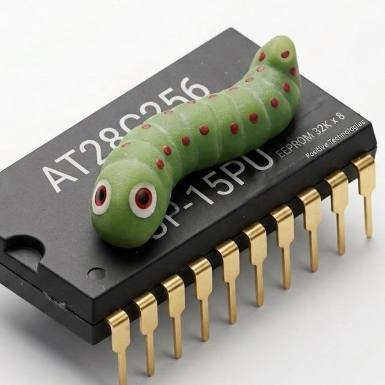
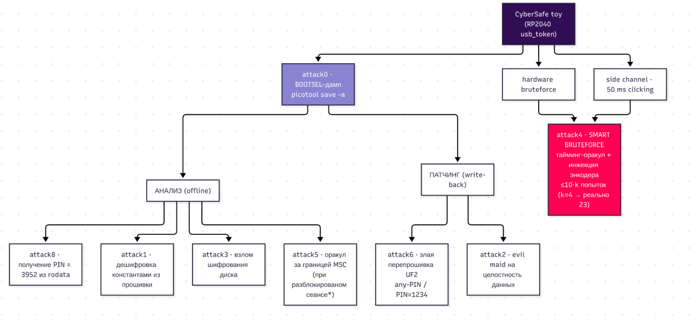

# case-12 

## Устройство

Сейф открывает USB Mass Storage после ввода PIN энкодером. [Вектор 0](attack0/README.md) показывает получение полного дампа через BOOTSEL независимо от кода; остальные отчёты описывают доступ к данным и подмену прошивки

По сообщению команды, организаторы поручили предоставить эксперту доступ к репозиторию Ghidra только на чтение; [учётные данные для эксперта](reversing/ghdira_credentials_readonly.txt) находятся в каталоге `reversing/`

## Навигация

| Каталог                              | Что внутри                                                           |
| ------------------------------------ | -------------------------------------------------------------------- |
| [`attack0/`](attack0/)               | извлечение дампа через BOOTSEL                                       |
| [`attack1/`](attack1/)               | расшифровка по параметрам из прошивки                                |
| [`attack2/`](attack2/)               | подмена содержимого хранилища                                        |
| [`attack3/`](attack3/)               | восстановление гаммы из шифротекста                                  |
| [`attack4/`](attack4/)               | физический тайминг-оракул PIN и видеозапись                          |
| [`attack5/`](attack5/)               | утечка гаммы за пределами области хранилища                          |
| [`attack6/`](attack6/)               | подмена прошивки через BOOTSEL                                       |
| [`attack7/`](attack7/)               | извлечение PIN из дампа                                              |
| [`artifacts/`](artifacts/)           | исходный дамп, ZIP и распаковщик архивных слоёв                      |
| [`reversing/`](reversing/)           | выделение программы из дампа и декомпиляция в Ghidra                 |
| [`drafts/`](drafts/)                 | гипотезы и каталог возможных векторов (черновые, не все реализованы) |
| [`.claude/skills/`](.claude/skills/) | локальные навыки для реверса, тестов и работы с проектом             |
| [`.claude/memory/`](.claude/memory/) | общая память проекта с находками                                     |

## Ghidra и ReVa

Проектные настройки MCP для Claude Code и opencode подключаются к серверу ReVa по адресу `http://localhost:8080/mcp/message`. Для работы инструментов нужно запустить Ghidra с ReVa; адрес подключения задан в [`.mcp.json`](.mcp.json) и [`opencode.json`](opencode.json)

## Локальные скиллы

### Для реверса

| Скилл | Назначение |
| --- | --- |
| [`binary-triage`](.claude/skills/binary-triage/SKILL.md) | первичный анализ бинарного файла |
| [`deep-analysis`](.claude/skills/deep-analysis/SKILL.md) | углублённый анализ функций через ReVa |
| [`pyghidra-scripting`](.claude/skills/pyghidra-scripting/SKILL.md) | выполнение PyGhidra-скриптов в сеансе ReVa |
| [`ctf-crypto`](.claude/skills/ctf-crypto/SKILL.md) | анализ криптографических задач |
| [`ctf-pwn`](.claude/skills/ctf-pwn/SKILL.md) | поиск ошибок эксплуатации бинарных файлов |
| [`ctf-rev`](.claude/skills/ctf-rev/SKILL.md) | решение задач реверс-инжиниринга |

### Для кода

| Скилл | Назначение |
| --- | --- |
| [`bash-best-practices`](.claude/skills/bash-best-practices/SKILL.md) | работа с shell-скриптами |
| [`code-comments`](.claude/skills/code-comments/SKILL.md) | написание и проверка комментариев в коде |
| [`tests`](.claude/skills/tests/SKILL.md) | проверка тестов и их результатов |

### Остальное

| Скилл | Назначение |
| --- | --- |
| [`obsidian-cli`](.claude/skills/obsidian-cli/SKILL.md) | работа с Obsidian |
| [`create-readme`](.claude/skills/create-readme/SKILL.md) | черновое оформление README проекта |
