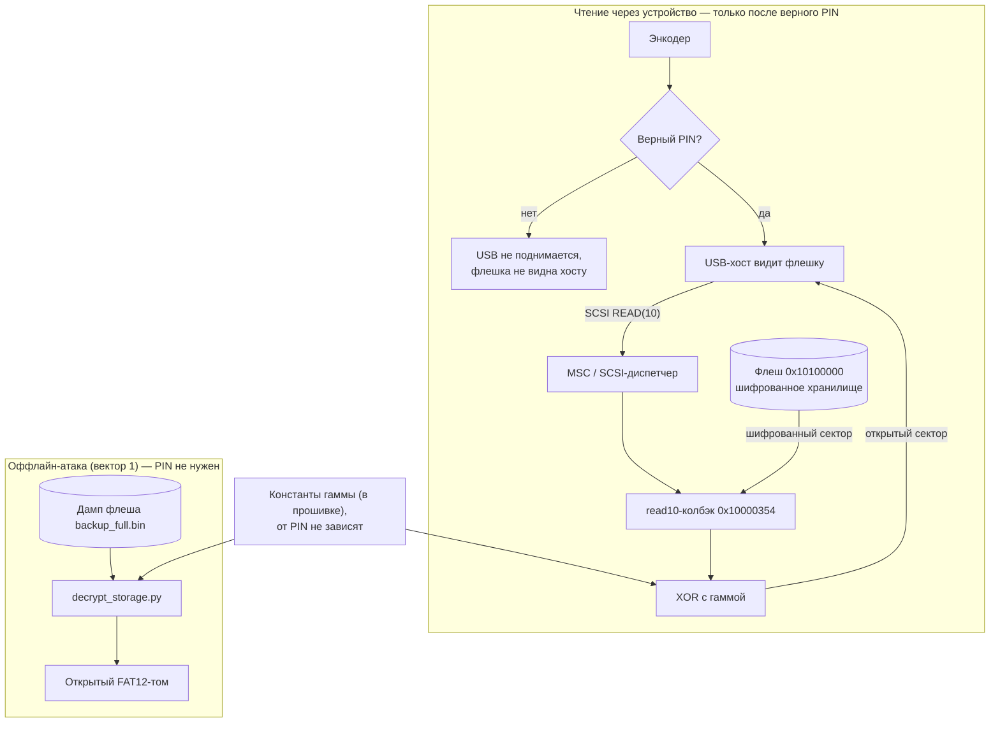
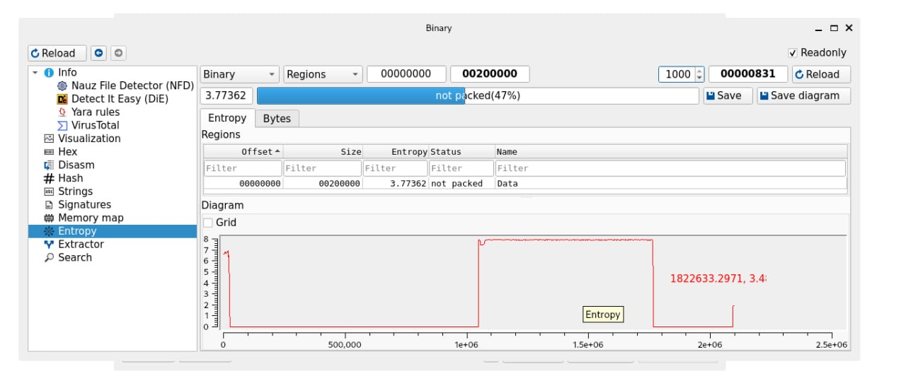

# Вектор 1 — фиксированный ключ шифрования

Скрытое хранилище кибер-сейфа расшифровывается напрямую из дампа флеша, потому что ключ шифрования зашит в саму прошивку и не зависит от PIN. Ни устройство, ни четырёхзначный код, ни энкодер для доступа к данным не нужны — достаточно снятого образа флеша, который можно получить через `picotool`, открыв bootloader через кнопку boot на плате. Механизм шифрования разобран [тут](#механизм-шифрования-хранилища)

## Класс угрозы

CWE-321, Use of Hard-coded Cryptographic Key. Секрет пользователя (4-значный PIN) никак не связан с ключом шифрования данных, а сам ключ (лежит в дампе по фиксированным адресам `0x100004ec..0x10000538`) читается прямо из образа прошивки — без запуска устройства и без ввода кода, просто анализом файла. То есть извлекается статически, из-за чего нарушается и конфиденциальность

## Суть

Расшифровка сектора реализована в `read10`-колбэке `0x10000354`: прошивка читает зашифрованный сектор из хранилища `0x10100000` и XOR-ит его гаммой перед выдачей на USB. Гамма собирается из констант в пуле `0x100004ec..0x10000538` — они лежат в XIP-флеше, доступном только на чтение, то есть это неизменные константы прошивки. PIN в вывод гаммы не входит нигде, поэтому ключ одинаков для всех устройств этой сборки и извлекается из образа

> [!NOTE]
> `read10` тут — это функция, позволяющая выполнить `READ(10)` из зашифрованного хранилища

Раз сама прошивка читается (на RP2040 нет ни защиты флеша от считывания, ни secure boot, а код и данные лежат в одной внешней QSPI-флешке), ключ достаётся вместе с ней, и хранилище расшифровывается без устройства

## Схема



PIN гейтит только видимость флешки на хосте, а не криптографию

## Эксплуатация

Скрипт [`decrypt_storage.py`](decrypt_storage.py) берёт зашифрованное хранилище со смещения `0x100000` в дампе, накладывает восстановленную гамму и пишет расшифрованный образ:

```
python3 decrypt_storage.py backup_full.bin storage_decrypted.img
```

Так, сектор 0 расшифровался в `EB 3C 90 "MSDOS5.0"` с сигнатурой `55 AA`, `file` подтвердил FAT12, в корне тома — `your_prize.zip`. То есть точное попадание в механику алгоритма. Полный лог — в [`demo_output.txt`](demo_output.txt)

### Механизм шифрования хранилища

Хранилище `0x10100000` (704 КБ, энтропия 8.0) — это **зашифрованный FAT12-том**. Высокая энтропия как раз доказывает шифр: открытый текст, включая исходники, даёт ~4–5 бит/байт, ровное плато на 8.0 бывает только у шифра или сжатия



`msc_read10_decrypt_storage` читает 512-байтный сектор из флеша и XOR-ит его keystream'ом перед отдачей на USB. Для 16-байтного блока при абсолютном LBA `L` и индексе блока `j` (0..31):

```
s = (L*0x38C9CDA0 + 0x9E37A9EA + j*0x41C64E6D) mod 2^32
keystream_byte_i = старший байт (s + C_i), i = 0..15
plaintext = ciphertext XOR keystream
```

Константы keystream (`C_i`) и параметры лежат в пуле `0x100004ec..0x10000538` внутри XIP-флеша — то есть это **read-only константы прошивки**. Ключ фиксирован, PIN в вывод keystream не входит нигде. `msc_write10_encrypt_storage` — зеркальная операция с параллельным пулом у `0x10000838`

## Оценка CVSS

Продемонстрировано раскрытие конфиденциальности: `CVSS:3.1/AV:P/AC:L/PR:N/UI:N/S:U/C:H/I:N/A:N` — **4.6 (Medium)**

- AV:P — нужен физический доступ, чтобы снять образ флеша
- AC:L, PR:N, UI:N — алгоритм детерминирован, ключ фиксирован, скрипт повторяем, ни прав, ни участия пользователя
- C:H — раскрывается всё хранилище целиком

Дамп снимается штатно: плата переводится в BOOTSEL (кнопка boot) и `picotool save -a backup_full.bin` читает всю флешку через USB-бутлоадер — ни пайки, ни спецоборудования, потому что на RP2040 нет защиты флеша от считывания. Это физический шаг, поэтому AV:P — честная и единственная реалистичная оценка. Барьер при этом крайне низкий (штатный инструмент, секунды), но CVSS всё равно относит недоступное по сети к Physical. Возможность подмены данных — это отдельный вектор (подмена содержимого хранилища), в этот отчёт не входит

## Как исправить

- выводить ключ шифрования из PIN через KDF (scrypt/PBKDF2/Argon2), чтобы без правильного кода гамма не собиралась
- привязывать ключ к аппаратному секрету, недоступному на чтение из прошивки (OTP-фьюзы, внешний защищённый элемент), чтобы дамп флеша сам по себе ключа не давал
- на самом RP2040 аппаратной опоры для этого нет — ни secure boot, ни защиты флеша от считывания, ни OTP под ключи: всё это появилось только в RP2350 (Pico 2)[^rp2350]. Радикально вектор закрывается сменой чипа на RP2350 или внешним защищённым элементом, на существующем железе — только программными пунктами выше

Впрочем, уже даже первого пункта хватает, чтобы сломать этот вектор атаки

[^rp2350]: RP2040 не имеет ни signed boot, ни защиты флеша от считывания, ни OTP под ключи — устройство грузится из внешней SPI-flash без проверки подписи. Подписанная загрузка (boot ROM как корень доверия), 8 КБ antifuse-OTP под ключи и TrustZone добавлены только в RP2350 — [Raspberry Pi, "Understanding RP2350's security features"](https://pip-assets.raspberrypi.com/categories/1260-security/documents/RP-009377-WP-1-Understanding%20RP2350_s%20security%20features.pdf)
