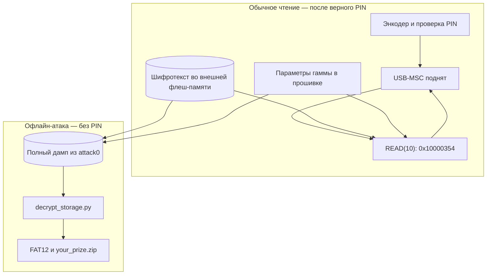

# Вектор 1 — фиксированные параметры шифрования в прошивке

Содержимое скрытого хранилища расшифровывается офлайн из [полного дампа флеш-памяти](../attack0/README.md): параметры гаммы записаны рядом с кодом прошивки и не зависят от PIN. Для расшифровки не нужно вводить код на устройстве

## Вектор атаки и классификация

**Классификация:** программная и криптографическая уязвимость, CWE-321 (жёстко заданный ключевой материал). Физический доступ нужен для получения дампа, но сама атака на шифрование выполняется над файлом

**Условия:** полный бинарный образ флеш-памяти. Способ его получения через BOOTSEL описан в [векторе 0](../attack0/README.md); сам дамп и производные артефакты находятся в [`artifacts/`](../artifacts/README.md)

## Механизм

При чтении сектора `msc_read10_decrypt_storage` (`0x10000354`) накладывает XOR-гамму на байты шифротекста из области `0x10100000`. Множители и константы гаммы хранятся в кодовой части той же внешней флеш-памяти, в пуле `0x100004ec–0x10000538`; проверка PIN в вывод гаммы не входит

Для блока `j` сектора с номером `L` прошивка вычисляет 32-битное значение, а для каждого байта берёт старший байт суммы с константой его позиции:

```text
s = (L*0x38C9CDA0 + 0x9E37A9EA + j*0x41C64E6D) mod 2^32
keystream_byte_i = top_byte(s + C_i), i = 0..15
plaintext = ciphertext XOR keystream
```

Значения `C_i` и остальные параметры находятся в одном источнике — [`decrypt_storage.py`](src/decrypt_storage.py). Высокая энтропия области хранилища видна на [снимке DiE](out/entropy-die.png), но сама по себе не доказывает именно шифрование; проверка — корректный результат расшифровки ниже



## Воспроизведение

Из корня репозитория на исходном образе:

```sh
python3 attack1/src/decrypt_storage.py artifacts/backup_full.bin /tmp/storage_decrypted.img
MTOOLS_SKIP_CHECK=1 mdir -i /tmp/storage_decrypted.img ::/
```

Дешифратор создаёт образ FAT12 объёмом 704 КиБ. Для независимой проверки архива `python3 artifacts/prepare.py artifacts/backup_full.bin --verify`: стенд повторяет расшифровку, извлекает ZIP через `mcopy`, проверяет CRC и сравнивает его с сохранённым архивом. Зависимости и происхождение артефактов — в [`artifacts/README.md`](../artifacts/README.md)

## Оценка атаки

**Сложность эксплуатации: низкая после получения дампа** — параметры читаются из прошивки, расшифровка детерминирована и реализована готовым PoC. Получение дампа требует краткого физического доступа; оценка CVSS 3.1 для этого сценария: `CVSS:3.1/AV:P/AC:L/PR:N/UI:N/S:U/C:H/I:N/A:N` — **4.6 (Medium)**

**Результат:** полный открытый FAT12-том без PIN и работающего сейфа. Этот вектор нарушает конфиденциальность; возможность подделки содержимого разобрана отдельно в [векторе 2](../attack2/README.md)

Физическое ограничение доступа к BOOTSEL затрудняет снятие образа, но не меняет того, что параметры лежат в том же читаемом дампе. Замена или маскировка их адресов внутри прошивки не устраняет причину атаки

### Как исправить

Не хранить секрет шифрования в читаемой внешней флеш-памяти вместе с данными

## Доказательство работоспособности

- При запуске на [`artifacts/backup_full.bin`](../artifacts/backup_full.bin) PoC выдаёт начало загрузочного сектора `EB 3C 90 4D 53 44 4F 53 35 2E 30`, сигнатуру `55 AA` и образ объёмом 720 896 байт; полный сохранённый протокол — [`demo_output.txt`](out/demo_output.txt)
- `file` распознаёт FAT12, а `mdir` показывает в корне `your_prize.zip`; [`artifacts/prepare.py`](../artifacts/prepare.py) извлекает архив и проверяет CRC и совпадение с [`artifacts/your_prize.zip`](../artifacts/your_prize.zip)
- `python3 -m unittest discover -s attack1/src -p 'test_*.py' -v` проверяет загрузочный сектор реального дампа и отбрасывает усечённый образ
