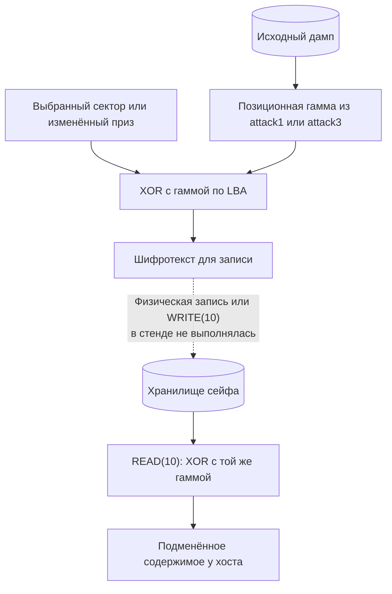

# Вектор 2 — подмена содержимого хранилища

Позиционная XOR-гамма не защищает целостность данных: зная её, атакующий может записать шифротекст, который сейф расшифрует в выбранное им содержимое. На сохранённом дампе это проверено как для отдельного сектора, так и для целого FAT12-тома с вложенным архивом приза

## Вектор атаки и классификация

**Классификация:** программная и криптографическая, CWE-345 (отсутствие проверки подлинности содержимого). Подмена исполняемой прошивки через BOOTSEL — отдельный [вектор 6](../attack6/README.md); здесь изменяются только данные хранилища

**Условия:** шифротекст хранилища, известная гамма и канал записи. Гамму можно получить из [прошивки](../attack1/README.md) или восстановить из [дампа](../attack3/README.md). Запись возможна через штатный `WRITE(10)` после разблокировки диска либо через BOOTSEL при физическом доступе; стенды этого отчёта **создают файлы для записи**, но не записывают их в живой сейф

## Механизм

`msc_read10_decrypt_storage` (`0x10000354`) накладывает гамму на сектор при выдаче хосту. `msc_write10_encrypt_storage` (`0x1000053c`) использует ту же позиционную гамму в обратном направлении. Если `C = P XOR K`, то для произвольного выбранного `P'` атакующий получает `C' = P' XOR K`; при следующем чтении `C' XOR K = P'`. В томе нет проверяемого MAC или подписи содержимого, поэтому этот путь не различает подлинный сектор и подделку



## Воспроизведение

### Ковка одного сектора

[`forge_sector.py`](forge_sector.py) восстанавливает гамму движком attack3, кодирует выбранную строку для LBA 48 и проверяет обратное XOR-преобразование. Вывод демонстрирует сектор, но скрипт **не записывает** его на плату

```sh
python3 attack2/forge_sector.py artifacts/backup_full.bin
```

### Подмена вложенного приза

[`evil_maid.py`](evil_maid.py) расшифровывает исходный том, извлекает `your_prize.zip`, открывает запароленные слои через [`matryoshka.py`](matryoshka.py), добавляет скрипт в исходный `prize.html` через [`bomb_html.py`](bomb_html.py) и собирает все слои с прежними числовыми паролями. Затем `mtools` записывает изменённый архив в FAT12, после чего том шифруется снова. Нужны `mtools`, `7z` и зависимости [attack3](../attack3/README.md)

```sh
python3 attack2/evil_maid.py artifacts/backup_full.bin /tmp/forged_storage.bin
python3 attack2/verify_forgery.py artifacts/backup_full.bin /tmp/forged_storage_fulldump.bin
python3 -B attack2/test_matryoshka.py
python3 -B attack2/test_bomb_html.py
python3 -m unittest discover -s attack2 -p 'test_verify_forgery.py' -v
python3 -m unittest discover -s attack2 -p 'test_browser_demo.py' -v
python3 attack2/browser_demo.py
```

Результаты — шифрованный том `/tmp/forged_storage.bin` и полный дамп `/tmp/forged_storage_fulldump.bin`. Для физического опыта на выделенной плате после перехода в BOOTSEL `picotool load -o 0x10100000 /tmp/forged_storage.bin` указывает адрес области хранения; **этот шаг не проводился**. Простое копирование BIN на служебный диск `RPI-RP2` не заменяет загрузку по протоколу `picotool`

## Оценка атаки

**Сложность эксплуатации: низкая для записи сектора, средняя для полного сценария с архивом** — требуется канал записи, а при его наличии подготовка шифротекста автоматизирована. Для воздействия только на целостность тома и физической записи `CVSS:3.1/AV:P/AC:L/PR:N/UI:N/S:U/C:N/I:H/A:N` — **4.6 (Medium)**; при доступном на локальном хосте разблокированном диске с `AV:L` — **6.2 (Medium)**

**Результат:** произвольное содержимое сектора и изменённый архив, которые дешифруются как обычный том. Вложенные пароли и исходная видимая разметка `prize.html` сохраняются, но файл **не побайтно идентичен**: добавленный `<script>` можно обнаружить анализом файла или сравнением хэшей

Добавленный JavaScript содержит gzip-сид и цикл выделения памяти через `DecompressionStream`. [`browser_demo.py`](browser_demo.py) запускает Chromium с **ограниченным числом копий** и проверяет распаковку и отображение заголовка; бесконечный цикл, крах вкладки и ущерб хосту **не измерялись**. Эффект на хосте требует, чтобы пользователь сам открыл страницу; оценка CVSS выше относится к доказанной подмене данных, а не к этому условному сценарию

### Как исправить

Проверять подлинность и целостность данных при чтении, например с помощью аутентифицированного шифрования с ключом, которого нет в доступном дампе. Для изменяемого FAT12-тома схема должна хранить и обновлять теги аутентификации и не повторять nonce при перезаписи. Подпись содержимого подходит для сценария, в котором обновление разрешено только доверенному подписанту. Защита только данных не остановит подмену самой прошивки через [вектор 6](../attack6/README.md)

## Доказательство работоспособности

- [`demo_output.txt`](demo_output.txt) фиксирует проход вложенных слоёв, сборку подменённого FAT12-тома и успешную обратную проверку PoC; тесты отдельно проверяют пароли, gzip-сид и сохранение исходной разметки
- [`verify_forgery.py`](verify_forgery.py) использует **независимый от attack3 дешифратор attack1**, читает оба тома через `mcopy`, распаковывает архивы другим [распаковщиком](../artifacts/unpack_layers.py) и сверяет финальные страницы. Проверка также требует совпадения всех байтов полного дампа вне области хранилища
- Проверены созданные файлы, ZIP-пароли, итоговая HTML-разметка и формула расшифровки. Chromium подтвердил распаковку gzip и два ограниченных выделения памяти; запись в аппаратный сейф и исполнение **неограниченного** цикла не проверялись
