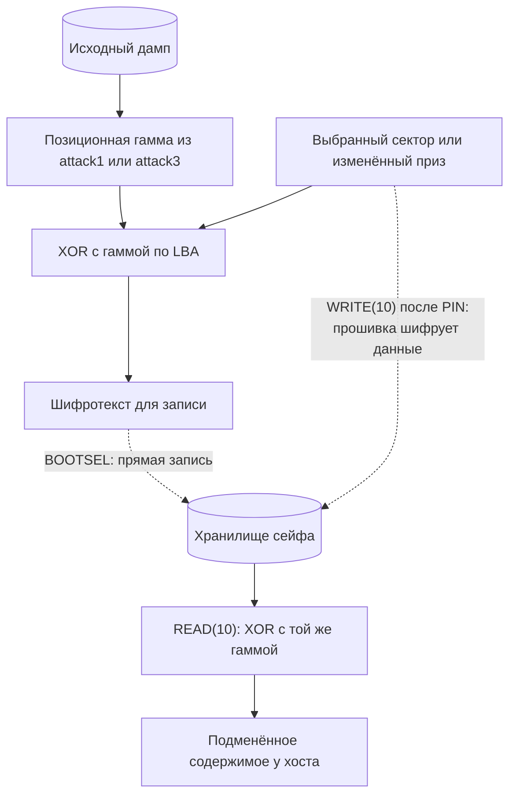

# Вектор 2 — подмена содержимого хранилища

Позиционная XOR-гамма не защищает целостность данных: зная её, атакующий может записать шифротекст, который сейф расшифрует в выбранное им содержимое. На сохранённом дампе это проверено как для отдельного сектора, так и для целого FAT12-тома с вложенным архивом приза

> [!IMPORTANT]
> Для демонстрации уязвимости в конечную страницу [prize.html](../artifacts/prize.html) добавлен JavaScript с gzip-нагрузкой на память; вложенные ZIP-архивы служат для доставки изменённой страницы

Вместо нагрузки на память можно внедрить скрипт, который отправит на удалённый сервер данные, доступные открытой странице

## Вектор атаки и классификация

**Классификация:** программная и криптографическая, CWE-345 (отсутствие проверки подлинности содержимого). Подмена исполняемой прошивки через BOOTSEL — отдельный [вектор 6](../attack6/README.md); здесь изменяются только данные хранилища

**Условия:** для подмены без PIN нужны физический доступ к BOOTSEL, исходный дамп и гамма, которую можно получить из [прошивки](../attack1/README.md) или восстановить из [дампа](../attack3/README.md). Стенды создают шифротекст для записи через BOOTSEL. Если диск уже разблокирован, доступный хост может изменить файлы обычной USB-записью без знания гаммы; это другой сценарий, поскольку прошивка сама шифрует входные данные

## Механизм

`msc_read10_decrypt_storage` (`0x10000354`) накладывает гамму на сектор при выдаче хосту. `msc_write10_encrypt_storage` (`0x1000053c`) применяет ту же гамму к входным **открытым** данным перед записью во флеш. Если `C = P XOR K`, то для выбранного `P'` атакующий может непосредственно записать `C' = P' XOR K` через BOOTSEL; при штатном чтении `C' XOR K = P'`. В томе нет проверяемого MAC или подписи содержимого, поэтому такая физическая подмена без разблокировки не обнаруживается проверкой подлинности. Посылать `C'` через `WRITE(10)` нельзя: прошивка наложит гамму ещё раз и запишет `P'` во флеш вместо `C'`



## Воспроизведение

### Патч одного сектора

[`forge_sector.py`](src/forge_sector.py) восстанавливает гамму движком [`attack3/`](../attack3/), кодирует выбранную строку для LBA 48 и проверяет обратное XOR-преобразование

```sh
python3 attack2/src/forge_sector.py artifacts/backup_full.bin
```

### Подмена вложенного приза

[`evil_maid.py`](src/evil_maid.py) расшифровывает исходный том, извлекает `your_prize.zip`, открывает запароленные слои через [`matryoshka.py`](src/matryoshka.py), добавляет скрипт в исходный `prize.html` через [`bomb_html.py`](src/bomb_html.py) и собирает все слои с прежними числовыми паролями. Затем `mtools` записывает изменённый архив в FAT12, после чего том шифруется снова. Нужны `mtools`, `7z` и зависимости [attack3](../attack3/README.md)

Для проверки полной архивной цепочки доступен [приз с 1337 запароленными слоями](out/your_prize_bounded.zip). Он сохраняет структуру исходного `your_prize.zip` и приводит к [ограниченному HTML](out/prize_bounded.html), который удерживает не более 16 копий распакованного блока по 16 МиБ. [Прямой ZIP с той же страницей](out/prize_bounded.zip) служит для проверки без распаковки слоёв. Эти архивы сохранены отдельно и не записаны в подменённый FAT12-том

```sh
python3 attack2/src/evil_maid.py artifacts/backup_full.bin /tmp/forged_storage.bin
python3 attack2/src/verify_forgery.py artifacts/backup_full.bin /tmp/forged_storage_fulldump.bin
python3 -B attack2/src/test_matryoshka.py
python3 -B attack2/src/test_bomb_html.py
python3 -m unittest discover -s attack2/src -p 'test_verify_forgery.py' -v
python3 -m unittest discover -s attack2/src -p 'test_browser_demo.py' -v
python3 attack2/src/browser_demo.py
python3 attack2/src/browser_demo.py --source artifacts/prize.html --copies 16
python3 attack2/src/evil_maid.py --bounded-archive artifacts/your_prize.zip /tmp/your_prize_bounded.zip 16
```

Результаты — шифрованный том `/tmp/forged_storage.bin` и полный дамп `/tmp/forged_storage_fulldump.bin`. Для записи на выделенную плату в BOOTSEL команда `picotool load -v -o 0x10100000 /tmp/forged_storage.bin` адресует только область хранения и проверяет запись; после перезапуска нужно разблокировать сейф и открыть изменённый архив. Полный дамп служит для офлайн-проверки, а не для загрузки вместо отдельного тома. Простое копирование BIN на служебный диск `RPI-RP2` не заменяет загрузку по протоколу `picotool`

## Оценка атаки

**Сложность эксплуатации: низкая для записи сектора, средняя для полного сценария с архивом** — для подмены через BOOTSEL нужны физический доступ и подготовленный шифротекст. Для воздействия только на целостность тома и физической записи `CVSS:3.1/AV:P/AC:L/PR:N/UI:N/S:U/C:N/I:H/A:N` — **4.6 (Medium)**. Запись через уже разблокированный USB-диск требует доступа к нему, но сама по себе не доказывает обход проверки подлинности: пользователь с доступом на запись может штатно менять файлы

**Результат:** произвольное содержимое сектора и изменённый архив, которые дешифруются как обычный том. Вложенные пароли и исходная видимая разметка `prize.html` сохраняются, но файл **не побайтно идентичен**: добавленный `<script>` можно обнаружить анализом файла или сравнением хэшей

Добавленный JavaScript содержит gzip-сид и цикл выделения памяти через `DecompressionStream`. [`browser_demo.py`](src/browser_demo.py) запускает Chromium с **ограниченным числом копий** и проверяет распаковку и отображение страницы; бесконечный цикл, крах вкладки и ущерб хосту **не измерялись**. Эффект на хосте требует, чтобы пользователь сам открыл страницу; оценка CVSS выше относится к доказанной подмене данных, а не к этому условному сценарию

Возможен и сценарий нарушения конфиденциальности: вместо цикла выделения памяти атакующий может внедрить JavaScript, который отправит на удалённый сервер персональные данные, доступные открытой странице, при наличии сетевого соединения и отсутствии блокирующей политики браузера. Открытие локального HTML само по себе не даёт скрипту доступа ко всем файлам хоста. Представленный PoC ничего не отправляет; утечка и ущерб конфиденциальности здесь не измерялись и не включены в оценку CVSS

### Как исправить

Проверять подлинность и целостность данных при чтении, например с помощью аутентифицированного шифрования с ключом, которого нет в доступном дампе. Для изменяемого FAT12-тома схема должна хранить и обновлять теги аутентификации и не повторять nonce при перезаписи. Подпись содержимого подходит для сценария, в котором обновление разрешено только доверенному подписанту. Защита только данных не остановит подмену самой прошивки через [вектор 6](../attack6/README.md)

## Доказательство работоспособности

- [`demo_output.txt`](out/demo_output.txt) фиксирует проход вложенных слоёв, сборку подменённого FAT12-тома и успешную обратную проверку PoC; тесты отдельно проверяют пароли, gzip-сид и сохранение исходной разметки
- [Многослойный ZIP](out/your_prize_bounded.zip) распакован независимым инструментом через все 1337 паролей до [ограниченного HTML](out/prize_bounded.html); [прямой ZIP](out/prize_bounded.zip) содержит тот же HTML. Chromium подтвердил остановку после 16 копий
- [`verify_forgery.py`](src/verify_forgery.py) использует **независимый от attack3 дешифратор attack1**, читает оба тома через `mcopy`, распаковывает архивы другим [распаковщиком](../artifacts/unpack_layers.py) и сверяет финальные страницы. Проверка также требует совпадения всех байтов полного дампа вне области хранилища
- Проверены созданные файлы, ZIP-пароли, итоговая HTML-разметка и формула расшифровки. Chromium подтвердил две копии в минимальном шаблоне и 16 копий в исходной странице; исполнение **неограниченного** цикла не проверялось
