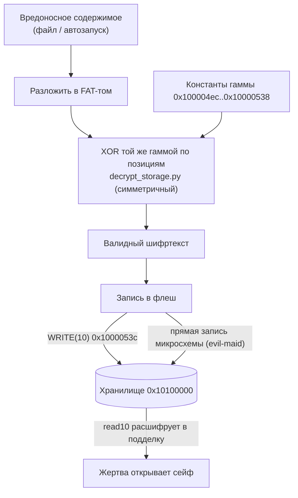

# Вектор 2 — подмена содержимого хранилища

Раз гамма шифрования известна (см. [вектор 1 — фиксированный ключ](../attack1/README.md)), а шифр симметричный, атакующий может не только читать хранилище, но и записать в него своё содержимое так, что устройство при чтении расшифрует его в валидные данные. Это открывает подсовывание вредоноса под видом законного содержимого сейфа. Классический evil-maid

Этот вектор — прямое следствие того, что шифр не аутентифицирован, и он же связан со слабостью самого примитива (отдельный вектор — слабость шифра)

## Класс угрозы

CWE-345, Insufficient Verification of Data Authenticity. Шифрование не аутентифицировано: нет ни подписи, ни MAC, поэтому устройство принимает любой корректно зашифрованный блок за подлинный. Смежно — CWE-494 (подстановка кода без проверки целостности), если в томе лежат исполняемые файлы

## Суть

Запись сектора реализована в `write10`-колбэке `0x1000053c` — это зеркало дешифратора: он шифрует сектор той же гаммой, что `read10` расшифровывает. Гамма зависит только от позиции (номер сектора и индекс блока) и от констант прошивки, поэтому воспроизводится оффлайн тем же скриптом ([`decrypt_storage.py`](../attack1/decrypt_storage.py), XOR — сам себе обратный)

> [!NOTE]
> `write10` тут — это функция, позволяющая выполнить `WRITE(10)` в зашифрованное хранилище

Сценарий: атакующий берёт вредоносное содержимое (заражённый файл, подменённый документ, автозапуск), раскладывает его в FAT-том, шифрует известной гаммой по позициям секторов и записывает в микросхему флеша напрямую (evil-maid, есть физический доступ) либо через USB `WRITE(10)`, если диск уже отдан после ввода PIN. Получение исходного образа для анализа описано в [векторе 0](../attack0/README.md). Легитимный пользователь потом открывает сейф и получает подделку как своё содержимое

## Схема пути записи



## Оценка CVSS

`CVSS:3.1/AV:P/AC:L/PR:N/UI:N/S:C/C:L/I:H/A:N` — **6.1 (Medium)**

- AV:P — физический доступ к флешу для записи (evil-maid)
- AC:L — гамма известна, шифрование тем же скриптом
- S:C (Changed) — если подсунутый вредонос исполняется на хосте жертвы, ущерб выходит за пределы токена
- I:H — целостность содержимого сейфа нарушается полностью, C:L — попутно нужна и читаемость структуры

Если диск разблокирован через PIN и запись идёт через USB без вскрытия платы, физический шаг пройден и вектор становится Local (`AV:L`), балл поднимается примерно до **7.8 (High)**. Консервативная оценка без выхода за пределы устройства (S:U, только целостность данных) — около **4.6**

## Как исправить

- перейти на аутентифицированное шифрование (AEAD: AES-GCM, ChaCha20-Poly1305), чтобы подделка без ключа аутентификации отвергалась
- подписывать содержимое хранилища и проверять подпись при чтении
- на RP2040 запись и чтение флеша извне ничем не закрыты — ни secure boot, ни readout protection (они только в RP2350), поэтому от evil-maid радикально спасает лишь аутентификация содержимого (AEAD/подпись) или переход на RP2350

## Пример кода — ковка сектора

[`forge_sector.py`](forge_sector.py) — рабочий PoC: восстанавливает гамму из холодного дампа (без прошивки и PIN, через [attack3](../attack3/README.md)), затем той же гаммой шифрует произвольный открытый текст под нужный LBA. Результат — шифртекст, который устройство при чтении расшифрует в подделку атакующего

Проверка round-trip: сектор, скованный под LBA 48, расшифровывается ровно в `OWNED BY THE EVIL MAID ...`, и никакой MAC его не отвергает (CWE-345). Этот шифртекст и есть то, что кладётся во флеш через `WRITE(10)`, BOOTSEL-перепрошивку или программатор

```
python3 forge_sector.py <dump> [target_LBA]
```

## Пример — подмена приза на бомбу без следов

[`evil_maid.py`](evil_maid.py) доводит подделку до цели: подменяет содержимое приза так, что жертва не видит подмены. Матрёшка приза (`your_prize.zip` → `layers.zip` → 1337 запароленных `layer_N.zip`, пароль слоя = его номер → `prize.html`) разворачивается, финальный `prize.html` подменяется, и матрёшка собирается обратно теми же паролями — все слои остаются подлинными на вид

Ключевое — подмена невидима до запуска:

- **пароли сохранены** — `layer_N.zip` по-прежнему открывается числом `N`, как обещает `readme.txt`; жертва проходит слои ровно как раньше
- **страница неотличима** — бомба не заменяет `prize.html`, а инъецируется в него ([`bomb_html.py`](bomb_html.py)): исходная разметка (rickroll) рендерится как была, добавлен лишь фоновый `<script>`
- **payload молчит и не вешает поток** — decompression-бомба: малый gzip-сид (base64) при `onload` разжимается и копится в памяти асинхронно, поэтому диалога "страница не отвечает" нет, а вкладку убивает OOM-киллер

Механизм подмены тот же, что у ковки сектора: гамма восстанавливается из дампа (движок [attack3](../attack3/README.md)), том расшифровывается, `prize.html` подменяется через `mtools` и `7z`, том шифруется обратно той же позиционной гаммой. Аутентификации нет (CWE-345), поэтому устройство отдаёт подделку как подлинное содержимое

Граница воздействия, честно: изоляция вкладок даёт каждой вкладке свой процесс с OOM-киллером, поэтому реалистичный эффект — гибель вкладки, не системы. Это PoC того, что неаутентифицированное хранилище позволяет подменить пассивное содержимое активным кодом, который жертва запускает сама

Зависимости: `mtools` (правка FAT12-тома) и `7z` (AES-256 слои матрёшки). Метод бомбы — non-recursive decompression, идея из ["A better zip bomb", D. Fifield, USENIX WOOT 2019](https://www.bamsoftware.com/hacks/zipbomb/)

```
python3 evil_maid.py <dump> [forged_storage.bin]
```

Прогон и тесты — [`demo_output.txt`](demo_output.txt); проверка компонентов — [`test_matryoshka.py`](test_matryoshka.py) (round-trip слоёв, пароль = номер, фальсификация) и [`test_bomb_html.py`](test_bomb_html.py) (инъекция сохраняет разметку, сид разжимается, payload молчит)
