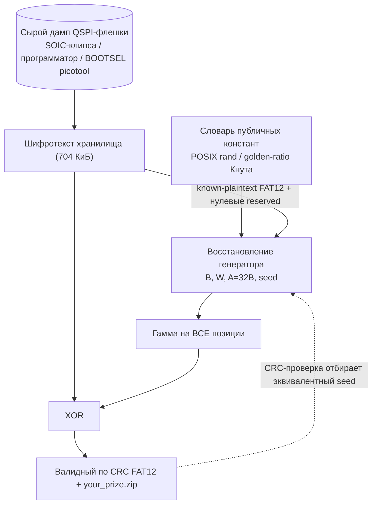

# Вектор 3 — вскрытие самодельного шифра из дампа

Самодельная гамма хранилища — слабый примитив: линейная, детерминированная и не привязанная ни к какому секрету (PIN в неё не входит). Поэтому скрытое хранилище расшифровывается целиком **без анализа прошивки, без знания PIN и без единого обращения к устройству**. По одному лишь сырому дампу внешней QSPI-флешки. Это дополняет [attack1](../attack1/README.md) (ключ лежит в прошивке): даже спрятанный "как следует" ключ не спас бы, потому что константы гаммы не извлекаются из образа, а восстанавливаются из самого шифротекста и предсказуемой структуры FAT12. PoC [`recover_keystream.py`](src/recover_keystream.py) делает это за 0.5 с и извлекает валидный по CRC архив

## Вектор атаки и классификация

**Классификация:** криптографическая и программная, CWE-327 (слабый самодельный примитив) и CWE-323 (повторное использование гаммы по позициям). CWE-1188/CWE-321 относятся к фиксированным параметрам, CWE-212 — к отсутствию безопасного стирания (N5)

**Условия:** один полный бинарный дамп флеш-памяти; получение его с платы — [вектор 0](../attack0/README.md). PoC не разбирает код прошивки, не читает PIN и не взаимодействует с работающим устройством

## Почему примитив непригоден

Дефект в самой конструкции. Её нельзя починить, просто перепрятав ключ:

- **гамма не зависит от секрета** — она выводится из номера сектора, индекса блока и констант прошивки, но не из PIN и вообще ни из какого секрета пользователя, поэтому защита данных не привязана ни к чему тайному
- **гамма детерминирована и одинакова везде** — для одной позиции она всегда одна и совпадает на всех устройствах сборки: одинаковые позиции дают одинаковый ключ-поток
- **конструкция линейная** — байт гаммы это старший байт линейной функции позиции (см. "Строение гаммы" ниже); по нескольким известным блокам закон восстанавливается и экстраполируется на все позиции
- **предсказуемый открытый текст** — том это FAT12 с известной структурой (загрузочный сектор, FAT-таблицы, нулевые reserved-секторы) плюс zip-заголовки; известный открытый текст, наложенный XOR на шифртекст, сразу даёт гамму для этих позиций
- **нет аутентификации** — ни MAC, ни подписи, поэтому подделка не отвергается (это же питает [подмену содержимого — attack2](../attack2/README.md))

Минимальный самодостаточный PoC самого принципа — [`known_plaintext.py`](src/known_plaintext.py): XOR предсказуемых байтов FAT12 с шифртекстом восстанавливает гамму на этих позициях без прошивки, PIN и устройства. Полное восстановление генератора и расшифровку всего тома доводит [`recover_keystream.py`](src/recover_keystream.py) (ниже)

## Строение гаммы (что именно восстанавливается)

Гамма — старший байт линейной функции позиции. Для байта со смещением `o` в секторе `L`:

```
global_block = L*32 + (o // 16)
V = ( seed + global_block*B + ((o % 16) - 1)*W )  mod 2^32
keystream_byte = V >> 24
plaintext = ciphertext XOR keystream_byte
```

Ключевые наблюдения:

- **два из трёх множителей — известные публичные константы**: `B = 0x41C64E6D` — множитель LCG из примера `rand()` в POSIX ([man7, rand(3)](https://man7.org/linux/man-pages/man3/rand.3.html)); это не алгоритм glibc `rand()`. `W = 0x9E3779B1` — константа мультипликативного хеша Кнута
- **множитель A не независим**: `A = 32*B mod 2^32` (генератор непрерывен, 32 блока по 16 байт на сектор) проверяется прямым умножением, отдельным секретом не является
- **побайтовые константы не отдельны**: `C_i = (i-1)*W` — арифметическая прогрессия, а не 16 независимых величин
- итог: единственный по-настоящему неизвестный параметр — аддитивный `seed`

## Как восстановить параметры из шифротекста

1. **B и W** — распознаются в словаре публичных RNG/hash-констант; проверка по консистентности с известным открытым текстом отбрасывает ложные пары
2. `A = 32*B` — производный
3. **seed** — интервальным пересечением на кольце `Z/2^32`. Источники позиций с известным открытым текстом: (а) предсказуемые байты загрузочного сектора FAT12 (переход `EB xx 90`, OEM `MSDOS5.0`, `bytes/sector = 512`, сигнатура `55 AA`), и (б) **зарезервированные секторы, которые штатный MS-DOS-форматтер оставляет нулевыми** — их открытый текст `0x00`, а значит шифротекст равен гамме напрямую (in-band оракул, см. [N1](src/extra_attacks.py))
4. **отбор эквивалентного seed из множества потенциальных значений** — ограничения по старшему байту оставляют много кандидатов. Проверка BPB и CRC вложенного ZIP отсеивает неверные расшифровки, но не отличает исходное значение seed от других значений с побайтово той же гаммой

### Про класс эквивалентности seed

Для всех байтов данного тома существует **75 эквивалентных значений seed от `0x9E37A9B7` до `0x9E37AA01`**. Это следует из границ младших 24 бит каждого вычисленного 32-битного слова; соседние значения меняют один байт расшифровки и нарушают CRC ZIP. PoC возвращает первое эквивалентное значение (`0x9E37A9B7`), а прошивка содержит `0x9E37A9EA`. Из данного шифротекста без дополнительной информации нельзя выбрать исходное значение среди эквивалентных; все 75 расшифровывают весь том одинаково

## Схема



## Дополнительные следствия

- **N1 — in-band оракул нулей**: нулевые области внутри тома (reserved-секторы, свободные кластеры, пустые записи FAT/каталога) отдают гамму напрямую (шифротекст == гамма). В этом дампе так утекает ~19 КиБ гаммы, и именно они бутстрапят восстановление — ни устройство, ни slack-секторы [attack5](../attack5/README.md) не нужны
- **N3 — мастер-таблица гаммы**: гамма зависит только от позиции и глобальных для сборки констант, поэтому одна предвычисленная таблица 704 КиБ = ключ всей серии. Расшифровка сводится к `xor` без кода и без знания констант; таблицу можно опубликовать один раз на все устройства
- **N4 — two-time-pad**: два тома, зашифрованных на одних позициях, делят гамму, и она сокращается: `C1 XOR C2 = P1 XOR P2`. При известной одной стороне (crib) вторая восстанавливается без ключа; стенд демонстрирует это на двух синтетических секторах
- **N5 — нет безопасного стирания**: удаление файла в FAT только помечает запись каталога байтом `0xE5`, данные в кластерах остаются; на сыром флеше с позиционной гаммой "удалённый" файл расшифровывается. Стенд моделирует удаление на синтетическом томе, а не утверждает, что файл удаляли на живом сейфе

демо — [`extra_attacks.py`](src/extra_attacks.py)

## Оценка атаки

**Сложность эксплуатации: низкая после получения дампа** — [`recover_keystream.py`](src/recover_keystream.py) автоматически выводит гамму из структуры FAT12 и проверяет результат по CRC ZIP. Получение дампа требует физического доступа: `CVSS:3.1/AV:P/AC:L/PR:N/UI:N/S:U/C:H/I:N/A:N` — **4.6 (Medium)**, как в [attack1](../attack1/README.md)

**Результат:** весь том расшифрован без извлечения констант из кода прошивки и без PIN. Мастер-таблица гаммы (N3) показывает, почему фиксированный поток затрагивает и другие устройства с той же прошивкой; это следствие алгоритма, а не отдельно выполненное чтение другой платы

Физический доступ к дампу остаётся необходимым для этого сценария. Переупаковка прошивки или сокрытие её констант не устраняет предсказуемость гаммы

### Как исправить

- заменить позиционную гамму на стойкое аутентифицированное шифрование с ключом, которого нет в читаемом дампе, см. [вектор 1](../attack1/README.md)
- использовать nonce, который не повторяется при новой записи сектора и между устройствами; постоянный номер сектора сам по себе не предотвращает two-time-pad (N4)
- при удалении обеспечить криптографическое стирание или перезапись соответствующих данных; изменение одной записи каталога FAT не стирает содержимое кластеров (N5)
- не полагаться на заполнение пустых секторов как исправление N1: FAT12 содержит предсказуемые байты и в служебных областях

## Воспроизведение и доказательство работоспособности

Входом служит [`artifacts/backup_full.bin`](../artifacts/backup_full.bin). Из корня репозитория:

```sh
python3 attack3/src/known_plaintext.py artifacts/backup_full.bin
python3 attack3/src/recover_keystream.py artifacts/backup_full.bin /tmp/attack3-storage.img
python3 attack3/src/extra_attacks.py artifacts/backup_full.bin
RECOVER_DUMP=artifacts/backup_full.bin python3 -B attack3/src/test_recover.py
```

[`demo_output.txt`](out/demo_output.txt) содержит сохранённый прогон на исходном дампе. `recover_keystream.py` проверяет CRC вложенного ZIP без эталонных констант; `test_recover.py` проверяет синтетический том, изменённый ZIP, изменённый словарь и реальный дамп. N1 и N3 проверены на исходном шифротексте, N4 и N5 — на синтетических данных с восстановленной гаммой. Полученный образ побайтно совпадает с выходом [дешифратора attack1](../attack1/src/decrypt_storage.py)
