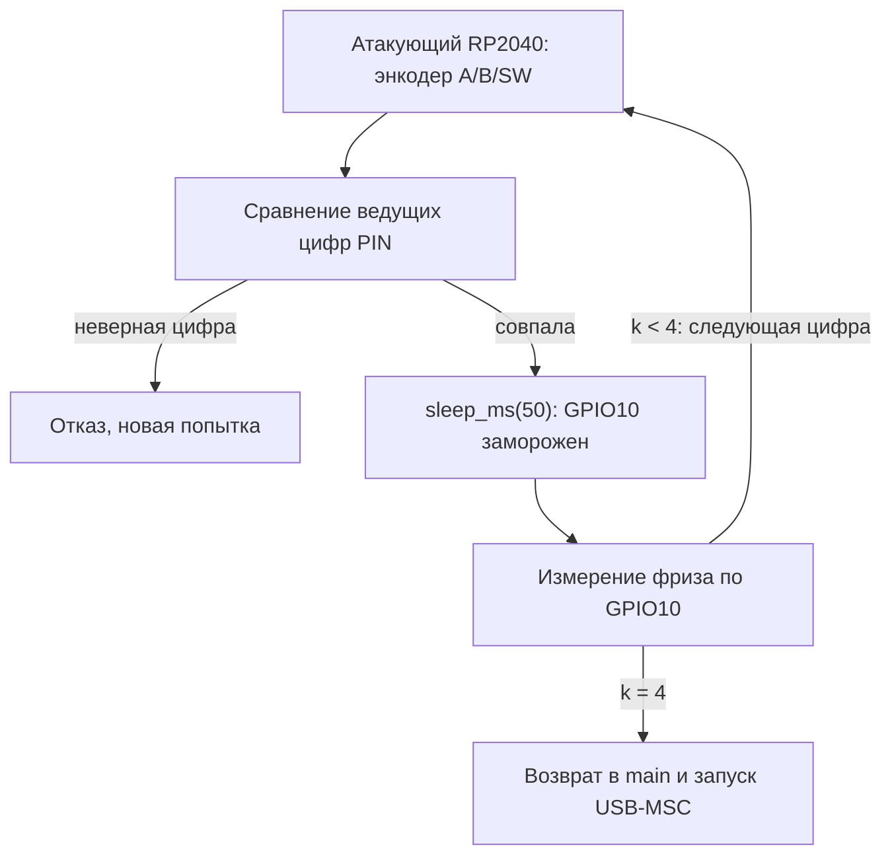

# Вектор 4 — восстановление PIN через тайминг-оракул энкодера

Прошивка добавляет 50 мс задержки за каждую верную ведущую цифру PIN и не ограничивает число попыток. Подключённый к линиям энкодера контроллер измеряет ответ индикатора и восстанавливает код посимвольно за не более 40 попыток ввода вместо полного перебора `10^4` комбинаций. На настоящем сейфе получен PIN `3952` за 23 попытки — [видеозапись](oracle-attack.mp4)

## Вектор атаки и классификация

**Классификация:** аппаратное воздействие на программную проверку аутентификации, CWE-208 (утечка через время ответа) и CWE-307 (нет ограничения попыток). Хранение PIN непосредственно в прошивке — отдельный [вектор 8](../attack8/README.md), которому физический тайминг-оракул не нужен

**Условия:** физический доступ к линиям энкодера A/B/SW и выходу индикатора GPIO10, общий GND и контроллер, способный вводить комбинации и измерять длительность фриза. Исходный PIN, дамп флеш-памяти и чтение USB-MSC до разблокировки не требуются

## Механизм

`board_gpio_init` (`0x10000ab0`) принимает четыре цифры с энкодера. На четвёртом нажатии проверка сравнивает их с эталоном; на каждую совпавшую ведущую цифру вызывается `sleep_ms(50)` (`0x10000c92`). После первого несовпадения сравнение прекращается. Во время задержки вывод GPIO10 не переключается: длина замороженного интервала показывает размер совпавшего префикса `k` от 0 до 4

Неверная комбинация вызывает анимацию отказа и снова допускает ввод. Только при верном коде `board_gpio_init` возвращает управление в `main`, после чего вызывается `tud_init` и хост видит USB-диск. Флаг SRAM `0x20002ED2` отражает разблокировку для индикации, но не заменяет возврат из блокирующего цикла



## Воспроизведение

### Живой стенд

Контроллер RP2040-Zero работает как энкодер в [`pico-encoder-emulator/`](pico-encoder-emulator/): `GP4` → A мишени (GPIO29), `GP2` → B (GPIO27), `GP3` → SW (GPIO28), `GP5` → выход индикатора GPIO10, земли объединены. Линии A и B подключены через резисторы 150–330 Ом. Между платами не соединяют `3V3` и `VBUS`; выходы энкодера работают в open-drain режиме

Прошивка атакующего контроллера принимает команду `o` для оракула, `t<code>` для разового замера и `n<pin>` для ручного ввода. Калибровки, которые обеспечили работу на живом сейфе: подтяжки `INPUT_PULLUP` в покое, четыре фронта по 5 мс на детент, пауза 100 мс между детентами и четвёртое нажатие во время низкой фазы GPIO10. Перед новым опытом сейф полностью обесточивают на 5–10 с: короткий сброс может сохранить флаг разблокировки в SRAM

### Эмулятор настоящей прошивки

Стенд [`emulator-stand/`](emulator-stand/) запускает сохранённый образ в rp2040js с bootrom RP2040 и подаёт сигналы энкодера в эмулированные GPIO. Из каталога `attack4/emulator-stand/` после `npm install` и подготовки bootrom:

```sh
node stand.mjs ../../artifacts/backup_full.bin 3952
node stand.mjs ../../artifacts/backup_full.bin 3951
node oracle_demo.mjs ../../artifacts/backup_full.bin 3951
node oracle_demo.mjs ../../artifacts/backup_full.bin 3952
```

`stand.mjs` возвращает ненулевой код для закрытого сейфа, поэтому запуск с `3951` **ожидаемо** завершается кодом 3. `oracle_demo.mjs` считывает эталон из дампа и завершится ошибкой, если число вызовов `sleep_ms(50)` или флаг разблокировки расходятся с ожидаемыми. USB-MSC хост этот стенд не эмулирует; успешный ввод подтверждается флагом, а не смонтированным томом

Дополнительная модель сравнения и перебора без аппаратуры — [`sim/emulator_sim.py`](sim/emulator_sim.py). Она проверяет алгоритм, но не заменяет прогон настоящего бинаря выше

## Оценка атаки

**Сложность эксплуатации: средняя** — нужны доступ к линиям, подключение второго контроллера и калибровка импульсов и замера. После настройки восстановление PIN требует не более 40 попыток, а не `10^4`. Оценка CVSS 3.1 для физического сценария: `CVSS:3.1/AV:P/AC:L/PR:N/UI:N/S:U/C:H/I:H/A:N` — **6.1 (Medium)**; класс `AC:L` относится к технической повторяемости после настройки, а не к отсутствию монтажной работы

**Результат:** разблокировка штатного USB-интерфейса без заранее известного PIN. Для доступа к данным другим путём есть [извлечение дампа](../attack0/README.md) и [офлайн-расшифровка](../attack1/README.md). Физическое ограничение энкодера и индикатора усложняет этот вектор, но не меняет утечку времени внутри проверки

## Доказательство работоспособности

- На [видео](oracle-attack.mp4) живой сейф разблокирован за 23 попытки; GPIO10 дал интервалы около 2/52/102/152/202 мс для 0–4 совпавших цифр
- [`oracle_demo.mjs`](emulator-stand/oracle_demo.mjs) на настоящем бинаре наблюдает 3 вызова `sleep_ms(50)` и закрытый флаг для `3951`, 4 вызова и открытый флаг для `3952`
- [`stand.mjs`](emulator-stand/stand.mjs) вводит коды через GPIO модели RP2040 и подтверждает, что `3952` открывает проверочный цикл, а `3951` — нет; сохранённые протоколы — в [`emulator-stand/`](emulator-stand/README.md)

## Как исправить

Ограничить число неверных попыток и убрать зависимость времени проверки от совпавшего префикса. Четырёхзначный PIN сам по себе не защищает содержимое при доступном дампе: независимый аппаратный секрет и шифрование хранилища должны препятствовать офлайн-обходу, см. [вектор 1](../attack1/README.md)
