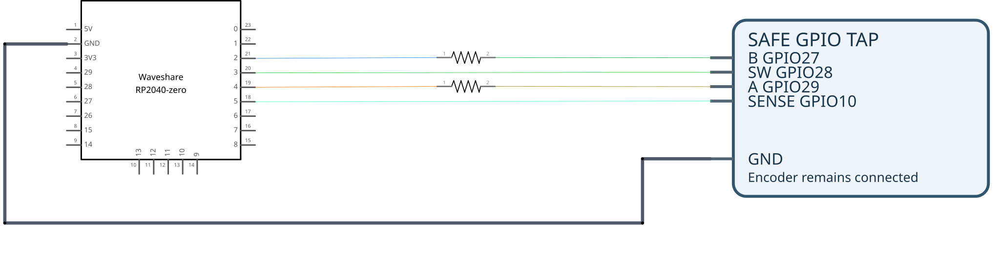

# Подключение атакующей Pico к сейфу для вектора 4

[Редактируемый проект Fritzing](out/attack4-wiring.fzz) показывает реально использованные линии и два последовательных резистора. Сейф изображён только известными контактами, а не восстановленной платой. На схеме выбраны резисторы 220 Ом как представитель испытанного диапазона 150–330 Ом; точное значение установленных резисторов не зафиксировано

Схема воспроизводится командой `python3 attack4/src/build_fritzing.py` из корня репозитория. Компонент RP2040-Zero [предоставлен участником сообщества Fritzing](https://forum.fritzing.org/t/part-request-waveshare-rp2040-zero/16705); генератор проверяет SHA-256 исходного файла и включает его в проект. Проект описывает монтаж стенда, а не печатную плату для изготовления

Условная схема фактически использованной установки с RP2040-Zero. Имена `GP2–GP5` относятся к атакующей плате, а `GPIO 10/27/28/29` — к контроллеру сейфа. Энкодер остаётся подключённым параллельно. Источники: [`pico-encoder-emulator/src/main.cpp`](pico-encoder-emulator/src/main.cpp) и [отчёт по вектору 4](README.md); общая карта выводов сейфа — [`reversing/GPIO_MAP.md`](../reversing/GPIO_MAP.md)

Питания двух плат `3V3` и `VBUS` между собой не соединены. GP5 считывает GPIO 10 и не подаёт на него уровень. GP2/GP4/GP3 тянут соответствующую линию только в LOW; в отпущенном состоянии код переводит их в `INPUT_PULLUP`, так что включается слабая подтяжка атакующей Pico. Это отличается от полностью отключённого драйвера без подтяжки. Штатные линии энкодера при этом остаются подключены

| Pico | Линия сейфа | Назначение | Соединение |
| --- | --- | --- | --- |
| GP4 | GPIO 29, A | Квадратурные импульсы A | Последовательный резистор 150–330 Ом |
| GP2 | GPIO 27, B | Квадратурные импульсы B | Последовательный резистор 150–330 Ом |
| GP3 | GPIO 28, SW | Имитация нажатия кнопки | Сигнальная линия |
| GP5 | GPIO 10 | Измерение паузы индикатора четвёртой позиции | Только вход, точка со стороны чипа |
| GND | GND | Общий опорный уровень сигналов | Общая земля |

После четвёртого нажатия PIN сравнивается посимвольно; на каждом совпавшем знаке исполнение задерживается на 50 мс. На GPIO 10 возникает пауза около `2/52/102/152/202 мс` для длины верного префикса `0/1/2/3/4`, измеренной на реальном сейфе. Именно эта линия уже используется в векторе 4
