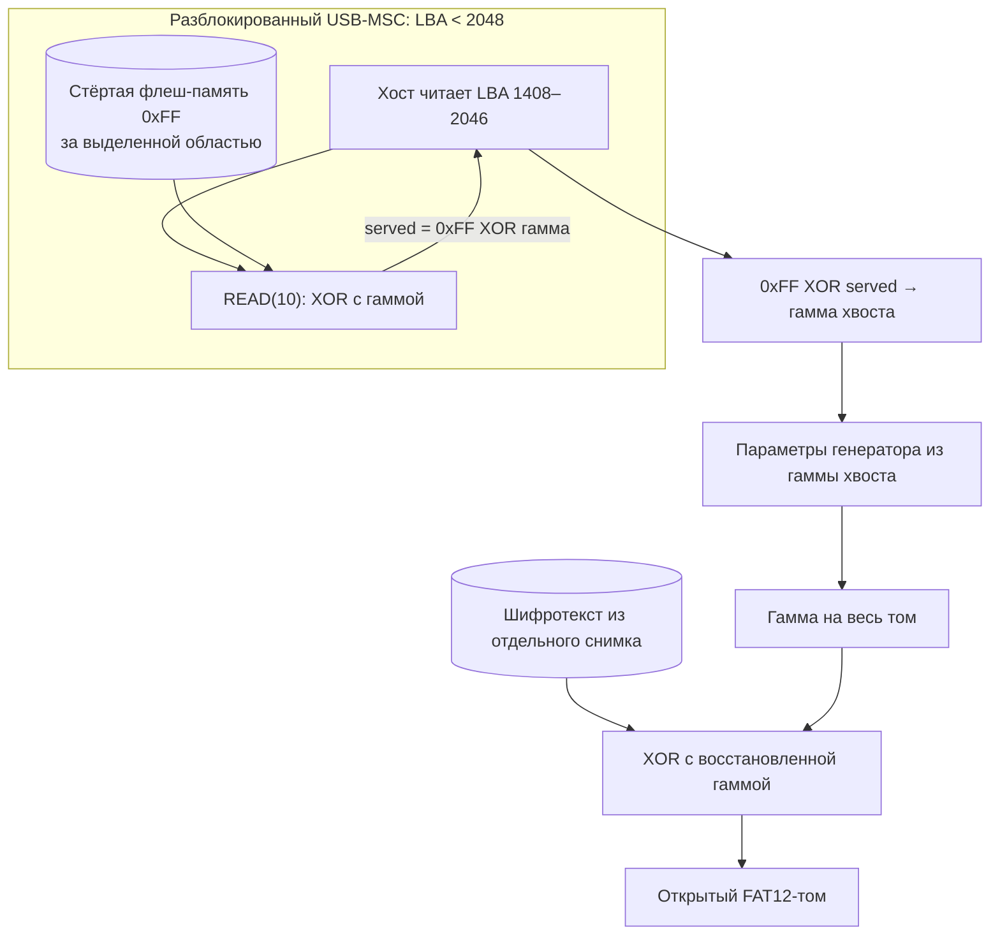

# Вектор 5 — утечка гаммы за границей хранилища

USB-MSC объявляет больше секторов, чем отведено под зашифрованное хранилище. При чтении стёртой флеш-памяти за его границей прошивка применяет к байтам `0xFF` гамму и возвращает её побитовое дополнение. Получив доступ к **уже разблокированному** диску, хост может собрать эту гамму без знания PIN и без анализа кода прошивки

## Вектор атаки и классификация

**Классификация:** программная ошибка границы доступного через MSC диапазона, CWE-805 (длина обслуживаемой области не соответствует выделенной). Слабость позиционной гаммы — отдельный [вектор 3](../attack3/README.md): она позволяет расширить утечку за границей на весь том

**Условия:** сеанс с разблокированным USB-диском и возможность читать его сырые сектора. Ввод PIN или [тайминг-атака](../attack4/README.md) нужны только для создания такого сеанса. Сам хост может не знать PIN. Встроенный демонстрационный стенд моделирует USB-ответы по сохранённому [дампу](../artifacts/backup_full.bin); прямое чтение этих секторов на живой плате пока не проводилось

## Механизм

Колбэк `msc_read10_decrypt_storage` (`0x10000354`) проверяет `LBA < 0x800` и обслуживает 2048 секторов. Под шифрованное хранилище выделено `0xB0000` байт, то есть **1408 секторов, LBA 0–1407**. Следовательно, с LBA **1408** запрос выходит за его логическую границу, но остаётся внутри объявленного MSC-диска

| LBA | Положение | Что видно в сохранённом дампе |
| --- | --- | --- |
| 1402 | внутри хранилища | записанные зашифрованные данные |
| 1403–1407 | внутри выделенной области | первые полностью стёртые сектора, ещё не выход за границу |
| 1408–2046 | за выделенной областью | 639 стёртых секторов `0xFF`, из которых можно получить гамму |
| 2047 | за выделенной областью | не стёрт; модель расшифровывает его в нули |

На стёртом секторе `served = 0xFF XOR keystream`, поэтому `keystream = 0xFF XOR served`. За границей выделенной области модель даёт **327 168 байт** гаммы. Первый стёртый сектор дампа — LBA 1403, но называть его первым сектором **вне** хранилища было ошибкой



## Воспроизведение

Из корня репозитория:

```sh
python3 attack5/src/keystream_leak_demo.py artifacts/backup_full.bin
python3 -m unittest discover -s attack5 -p 'test_*.py' -v
```

[`keystream_leak_demo.py`](src/keystream_leak_demo.py) использует [дешифратор attack1](../attack1/src/decrypt_storage.py) **только для моделирования USB-ответов** из сырого образа. Функция восстановления получает исключительно байты смоделированного хвоста и словарь публичных констант из attack3. После восстановления скрипт отдельно расшифровывает том исходного дампа и проверяет FAT12 и CRC ZIP — это проверка предсказания, а не вход восстановления

Для физического замера после разблокировки нужно считать сырые LBA 1408–2047 с USB-диска в файл из 640 секторов. В Linux, после определения правильного блочного устройства, это можно сделать командой `dd if=/dev/sdX of=/tmp/usb-tail.bin bs=512 skip=1408 count=640 iflag=fullblock`. Получить полный поток **без дампа** можно командой `python3 attack5/src/keystream_leak_demo.py --usb-tail-only /tmp/usb-tail.bin /tmp/keystream.bin`: она читает только файл USB-ответов и не импортирует константы из прошивки. Для отдельной проверки результата на сохранённом образе служит `python3 attack5/src/keystream_leak_demo.py artifacts/backup_full.bin --usb-tail /tmp/usb-tail.bin`; этот режим сравнивает захваченный хвост с моделью **того же** образа. Настоящий хвост с платы здесь не снимался

## Оценка атаки

**Сложность эксплуатации: низкая при доступе к разблокированному хосту** — нужен последовательный секторный запрос и известный открытый текст стёртого флеша. Получение самого разблокированного сеанса требует иных условий. Для физического сценария `CVSS:3.1/AV:P/AC:L/PR:N/UI:N/S:U/C:H/I:N/A:N` — **4.6 (Medium)**; при уже доступном локальному хосту диске замена `AV:P` на `AV:L` даёт **6.2 (Medium)**

**Результат:** восстановленный позиционный поток позволяет расшифровать будущий или отдельный сырой снимок тома этой сборки. Хост текущего разблокированного сеанса уже видит открытые файлы; дополнительное воздействие — сохранение гаммы для других снимков и повторного применения к той же схеме шифрования

Оракул здесь зависит от байтов флеша за выделенной областью: в исследованном дампе они стёрты, кроме последнего сектора. Наличие такой же области на другой плате этим стендом не проверялось. Даже если заменить шифр, чтение за логической границей остаётся отдельным дефектом

### Как исправить

Согласовать число секторов в MSC, фактическую выделенную область флеш-памяти и размер тома в FAT12. Отклонять чтение **и запись** любого LBA за выделенной областью до применения гаммы. Одной заменой параметра MSC без согласования с FAT12 можно нарушить работу файловой системы; заполнение хвоста случайными данными лишь маскирует утечку, но не исправляет границу

## Доказательство работоспособности

- [`demo_output.txt`](out/demo_output.txt) фиксирует моделирование USB-ответа за реальной границей LBA 1408 и восстановление параметров без шифротекста на входе функции
- [`test_keystream_leak_demo.py`](src/test_keystream_leak_demo.py) проверяет восстановление только из хвоста, отдельный режим экспорта полной гаммы без дампа и отказ на противоречивом наблюдении; затем использует сохранённый шифротекст **только как независимую проверку** валидного ZIP
- Настоящий USB-MSC ответ сейфа не записан; утверждение о его выдаче следует из статического разбора `READ(10)` и проверенной модели, а не из проведённого аппаратного замера
