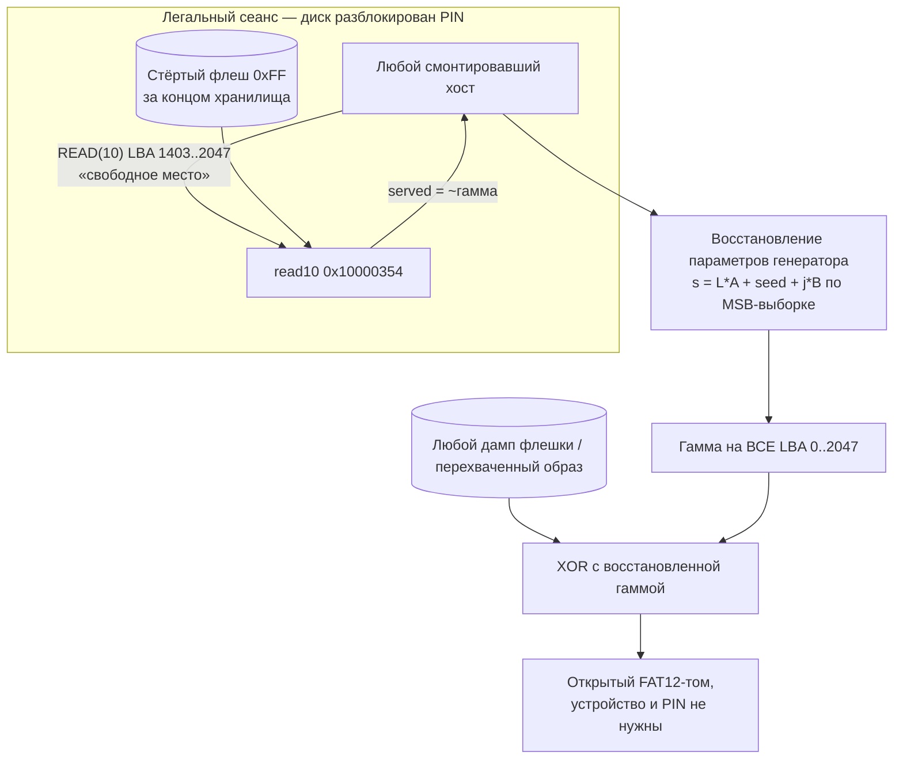

# Вектор 5 — оракул гаммы из «пустого места» диска

Прим.: нумерация «вектор 5» здесь — это номер каталога `attack5/`; гипотезы 5/6/8 из
[`hypotheses.md`](../hypotheses.md) — независимая нумерация и к этому каталогу отношения не имеют

Скрытое хранилище можно расшифровать **без реверса прошивки, без дампа образа и без знания PIN** —
достаточно одного сеанса с разблокированным диском. Устройство само отдаёт атакующему чистую
гамму шифра как «свободное место» тома, а самодельный шифр линеен, поэтому по собранному хвосту
гамма восстанавливается на весь диск. Это развитие [attack3](../attack3/README.md) («шифр слаб»)
с заменой самого дорогого шага: вместо анализа кода константы гаммы вычисляются из того, что
устройство легально показывает хосту

## Класс угрозы

CWE-805, Buffer Access with Incorrect Length Value. MSC-дескриптор и проверка границ в
`msc_read10_decrypt_storage` (`0x10000354`) объявляют диск в `0x800` секторов (1 МиБ:
`param_2 < 0x800`), тогда как шифрованная область занимает только `0xB0000` (704 КиБ, 1408
секторов). Чтение секторов 1408..2047 проходит проверку честно и уходит за пределы
шифрованной области — устройство «расшифровывает» стёртую флешку (`0xFF`) и отдаёт хосту
`keystream XOR 0xFF`, то есть чистую гамму. Смежно: CWE-130 (несогласованность объявленного
и фактического размера), CWE-323 (повторное использование гаммы) — следствие для криптосхемы

## Суть

Проверка в `read10`-колбэке отсекает только LBA вне объявленного диска:

```c
if ((param_3 < 0x200) && (param_2 < 0x800)) {   // 0x800 = 2048 секторов = 1 МиБ
```

но зашифрованное хранилище кончается на секторе 1408 (`0x10100000 + 0xB0000 = 0x101B0000`).
Флеш за ним стёрт, и после XOR с гаммой хост получает не «пустоту», а побитное дополнение
гаммы. В [демо](keystream_leak_demo.py) по дампу граница видна вплотную: сектор LBA 1402 ещё
внутри (расшифровывается в осмысленное содержимое тома), LBA 1403 — уже чистая утечка


Гамма сектора зависит только от номера сектора и индекса 16-байтного блока — тех же
параметров, что и для области хранилища, никакой «отдельной гаммы» для хвоста нет. Собранный
хвост — это 644 стёртых сектора ≈ **322 КиБ чистой гаммы** последовательным чтением одного
диапазона LBA

## Схема



## Эксплуатация

1. Получить любой сеанс с разблокированным диском (свой PIN, [`pin/`](../pin/), [attack4](../attack4/)
   или социальный доступ) и смонтировать его как обычную флешку
2. Прочитать «свободное место»: LBA 1403..2047, ~322 КиБ — это чистая гамма (`~ks`)
3. Восстановить параметры генератора. Внутри одного сектора все 32 блока и все 16 байтов
   «дорожек» `C_i` выборкой покрыты целиком — по переносной цепочке старших байтов
   восстанавливаются `B` и `C_i`; по интервалам между секторами — `A` и `seed`. Это классическая
   задача восстановления LCG по старшим битам (решается решёткой/перебором переносов), и
   конструкция шифра делает её дешёвой — см. ниже «связь со строением шифра»
4. Экстраполировать гамму на LBA 0..1402 и расшифровать любой снимок хранилища офлайн —
   тем же скриптом, что в [attack1](../attack1/README.md), но с вычисленными, а не вырезанными
   из прошивки константами

Шаг 3 в PoC не реализован (он не требует устройства и делается офлайн над собранной выборкой);
шаги 1–2 и модель утечки полностью проверены — [demo_output.txt](demo_output.txt):

```
[1] первый полностью стёртый сектор флеша: LBA 1403 (0x57b)
    LBA 1403..2047 лежат ВНЕ шифрованной области (645 секторов = 322 КиБ утечки)
[2] LBA 1403 (0x57b): вне хранилища -> УТЕЧКА (~гамма)
    flash : ff ff ff ff ff ff ff ff ff ff ff ff ff ff ff ff
    served: c6 27 89 eb 4d ae 10 72 d4 36 97 f9 5b bd 1e 80  entropy=7.253 бит/байт
[3] OK — 644 стёртых секторов отдаются ровно как ~гамма
    суммарно хост собирает ~329728 байт чистой гаммы одним последовательным чтением
```

Единственное исключение — LBA 2047: он не стёрт, а содержит зашифрованные нули (артефакт
записи образа при производстве), обслуживается как `0x00` и в оракул не годится; на 644
остальных секторах модель сходится побайтно

Проверка без устройства тоже возможна: если константы уже вырезаны из прошивки по
[attack1](../attack1/README.md), `keystream_leak_demo.py` подтверждает утечку на дампе; но
сам вектор ценен именно тем, что константы не нужны

## Связь со строением шифра (почему восстановление дешёвое)

- **Гамма берётся только старшим байтом** `(s + C_i) >> 24` — 16 байтов данных на один
  32-битный ресурс состояния. С одной стороны это сжатие энтропии в 16 раз, с другой —
  старший байт слабо перемешивает младшие биты состояния: последовательность старших байтов
  при известном шаге восстанавливается через цепочку переносов, а неверная гипотеза
  параметров отбрасывается по первому же несовпадении байта. Большая выборка (32 блока ×
  16 дорожек × 644 сектора) делает решение избыточным
- **Константы глобальны** — одинаковые у всех плат сборки: восстановление проводится
  однократно и годится для любого устройства и любого дампа, включая чужие; выборка с одной
  платы достаётся всей «команде» атакующих
- **Период гаммы не спасает**: множитель `A = 0x38C9CDA0` делится на 2⁵, поэтому `s(L)`
  повторяется только с периодом 2²⁷ по L — внутри 1-МиБ диска коллизий гаммы нет, короткого
  пути через повтор потока нет, восстановление параметров по выборке — единственный и
  достаточный маршрут

Отдельный бонус того же корня: [гипотеза 6 из hypotheses.md](../hypotheses.md) (обход границ
через переполнение) закрывается этой же проверкой — `param_2 < 0x800` отсекает переполненные
LBA до всякой арифметики переноса, а «легальная» половина проблемы (обслуживание за концом
области) сильнее переполнения и не требует его вовсе

## Оценка CVSS

Базовый сценарий (нужен физический доступ, чтобы получить любой разблокированный сеанс):
`CVSS:3.1/AV:P/AC:L/PR:N/UI:N/S:U/C:H/I:N/A:N` — **4.6 (Medium)** — как в
[attack1](../attack1/README.md)

Сценарий «хост уже видит диск» (гость/киоск/широко раздаваемый сеанс): физический шаг уже
пройден, вектор становится `AV:L`, и он выше attack1 тем, что не требует вскрывать плату и снимать
дамп через BOOTSEL — достаточно прав на чтение смонтированного тома: около **6.1 (Medium)**
по той же логике, что в [attack2](../attack2/README.md)

Итоговое воздействие совпадает с attack3 — полная конфиденциальность хранилища, — но барьер
ниже: не нужны ни пайка, ни BOOTSEL, ни реверс прошивки, достаточно один раз оказаться хостом
разблокированного устройства

## Как исправить

- объявлять в MSC ровно фактический размер шифрованной области (`0x580` секторов), а не
  размер тома: `block_count = STORAGE_LEN / 512`, и отклонять LBA вне её как read error —
  это закрывает вектор полностью и одним изменением
- не отдавать «расшифрованное» содержимое за пределами области ни в каком виде: стёртый хвост
  отвечать константой (`0xFF`) или ошибкой, не пропуская его через гамму
- системная защита — та же, что в [attack1](../attack1/README.md)/[attack3](../attack3/README.md):
  ключ из `KDF(PIN)` + аппаратный секрет и аутентифицированный шифр (AEAD); лёгкий промежуточный
  вариант — заполнить хвост диска случайными данными при производстве, чтобы утечка перестала
  быть детерминированной функцией позиции (не чинит крипту, но ломает оракул)
