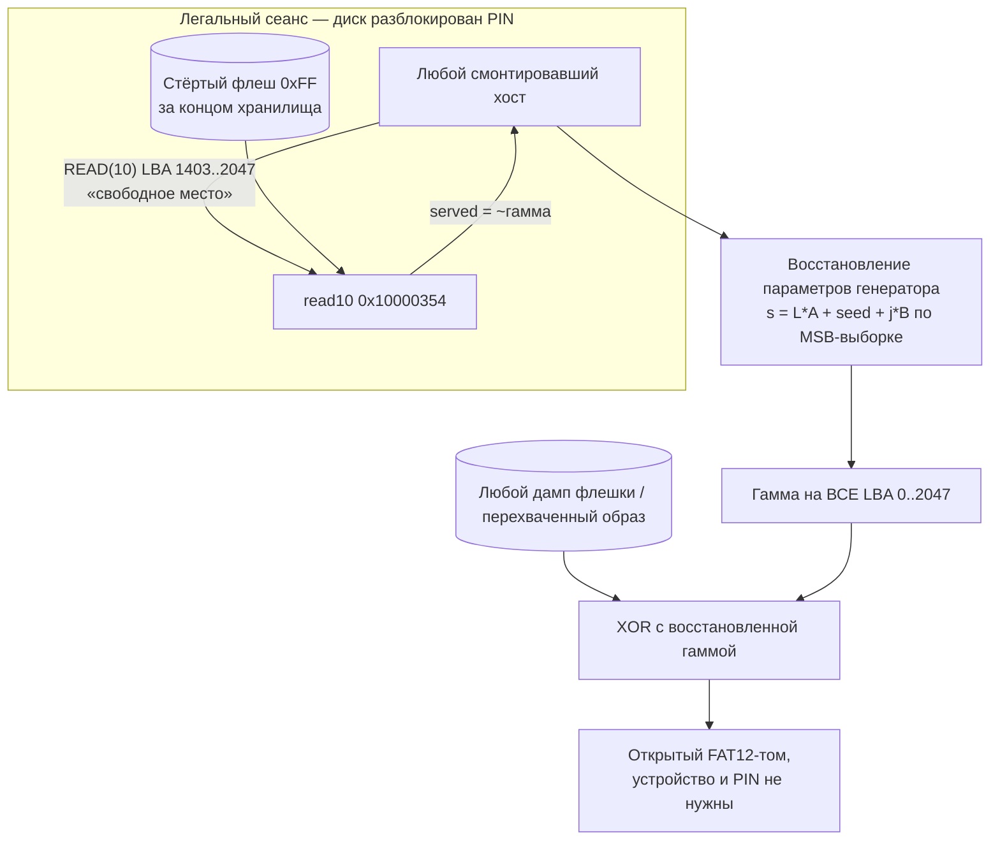

# Вектор 5 — оракул расшифровки за границей области MSC

Живое устройство само, на легальном чтении, расшифровывает и отдаёт хосту сектора за концом шифрованного хранилища. Это динамический оракул расшифровки: не нужны ни дамп флеша, ни реверс прошивки, ни знание PIN — достаточно один раз оказаться хостом разблокированного диска. За объявленной границей лежит стёртый флеш, поэтому сейчас оракул отдаёт чистую гамму, а линейный шифр ([attack3](../attack3/README.md)) по ней вскрывается на весь диск

## Класс угрозы

CWE-805, Buffer Access with Incorrect Length Value. MSC-дескриптор и проверка границ в `msc_read10_decrypt_storage` (`0x10000354`) объявляют диск в `0x800` секторов (1 МиБ: `param_2 < 0x800`), тогда как шифрованная область занимает только `0xB0000` (704 КиБ, 1408 секторов). Чтение секторов 1408..2047 проходит проверку честно и уходит за пределы шифрованной области — устройство "расшифровывает" стёртую флешку (`0xFF`) и отдаёт хосту `keystream XOR 0xFF`, то есть чистую гамму. Смежно: CWE-130 (несогласованность объявленного и фактического размера), CWE-323 (повторное использование гаммы) — следствие для криптосхемы

## Суть

Проверка в `read10`-колбэке отсекает только LBA вне объявленного диска:

```c
if ((param_3 < 0x200) && (param_2 < 0x800)) {   // 0x800 = 2048 секторов = 1 МиБ
```

но зашифрованное хранилище кончается на секторе 1408 (`0x10100000 + 0xB0000 = 0x101B0000`). Флеш за ним стёрт, и после XOR с гаммой хост получает не "пустоту", а побитное дополнение гаммы. В [демо](keystream_leak_demo.py) по дампу граница видна вплотную: сектор LBA 1402 ещё внутри (расшифровывается в осмысленное содержимое тома), LBA 1403 — уже чистая утечка

Гамма сектора зависит только от номера сектора и индекса 16-байтного блока — тех же параметров, что и для области хранилища, никакой "отдельной гаммы" для хвоста нет. Собранный хвост — это 644 стёртых сектора ≈ 322 КиБ чистой гаммы последовательным чтением одного диапазона LBA

## Что это на самом деле — оракул, а не ещё одна утечка гаммы

Важен не факт "получили гамму" — её даёт и холодный дамп ([attack3](../attack3/README.md)). Важно, что живое устройство само декодирует и отдаёт наружу то, что лежит за задуманной границей области, на обычном легальном чтении смонтированного тома

Из этого следуют три уровня прочтения:

- **честная ограниченность** — в этой прошивке за границей лежит стёртый флеш, поэтому отданное равно чистой гамме; данных, которых нет в холодном дампе, оракул не добавляет. Единственный реальный выигрыш над [attack3](../attack3/README.md) — снятый барьер: не нужны ни выпайка, ни BOOTSEL, ни реверс, достаточно прав на чтение смонтированного тома (`AV:P` → `AV:L`)
- **контрфактик для этой же прошивки** — будь ключ выведен из `KDF(PIN)`, позиционная гамма исчезла бы, но сам баг границ остался бы утечкой ключевого потока: только уже привязанного к устройству, и масштаб воздействия упал бы с "вся серия" ([N3 в attack3](../attack3/README.md)) до одного устройства. Слабость шифра и ошибка границ — два независимых дефекта, и второй не чинится починкой первого
- **обобщение класса CWE-805** (экстраполяция, а не факт об этой прошивке) — дефект в общем виде звучит как "устройство отдаёт наружу декодированное содержимое за границей буфера". Что именно утечёт, зависит от того, что лежит за границей. Здесь — гамма; при другой раскладке тем же классом за границу отдаваемого диапазона утёк бы любой чувствительный артефакт, попавший в него

## Схема



## Эксплуатация

1. Получить любой сеанс с разблокированным диском (свой PIN, [`pin/`](../pin/), [attack4](../attack4/) или социальный доступ) и смонтировать его как обычную флешку
2. Прочитать "свободное место": LBA 1403..2047, ~322 КиБ — это чистая гамма (`~ks`). Стёртый флеш за концом тома известен как `0xFF`, поэтому `ks = 0xFF XOR served` — тот же приём, что нулевые reserved-секторы в [attack3](../attack3/README.md), только источник открытого текста иной
3. Восстановить параметры генератора из собранной гаммы. Внутри одного сектора все 32 блока и все 16 "дорожек" покрыты выборкой целиком; множители `B`, `W` — публичные константы, `A = 32*B` производный, а `seed` берётся интервальным пересечением на кольце `Z/2^32`. Шаг реализован в [`keystream_leak_demo.py`](keystream_leak_demo.py) движком восстановления из [attack3](../attack3/recover_keystream.py) — без вшитых констант прошивки
4. Экстраполировать гамму на LBA 0..1407 и расшифровать хранилище офлайн; корректность подтверждается тем же признаком, что в [attack3](../attack3/README.md) — валидный по CRC ZIP внутри FAT12-тома

Модель утечки и восстановление генератора проверены на дампе end-to-end — [demo_output.txt](demo_output.txt):

```
[1] первый полностью стёртый сектор флеша: LBA 1403 (0x57b)
    LBA 1403..2047 лежат ВНЕ шифрованной области (645 секторов = 322 КиБ утечки)
[2] LBA 1403 (0x57b): вне хранилища -> УТЕЧКА (~гамма)
    flash : ff ff ff ff ff ff ff ff ff ff ff ff ff ff ff ff
    served: c6 27 89 eb 4d ae 10 72 d4 36 97 f9 5b bd 1e 80  entropy=7.253 бит/байт
[3] OK — 644 стёртых секторов отдаются ровно как ~гамма
```

Единственное исключение — LBA 2047: он не стёрт, а содержит зашифрованные нули (артефакт записи образа при производстве), обслуживается как `0x00` и в оракул не годится; на 644 остальных секторах модель сходится побайтно

## Связь со строением шифра — почему восстановление дешёвое и точное

- **гамма берётся только старшим байтом** `(s + C_i) >> 24` — 16 байтов данных на один 32-битный ресурс состояния. Старший байт слабо перемешивает младшие биты, поэтому последовательность старших байтов при известном шаге восстанавливается через цепочку переносов, а неверная гипотеза параметров отбрасывается по первому же несовпадении байта. Выборка 32 блока × 16 дорожек × 644 сектора делает решение избыточным
- **выборка избыточна** — 322 КиБ подряд (644 сектора по 512 байт) переопределяют генератор многократно, поэтому восстановление мгновенно и не зависит от удачных позиций. `seed` при этом выходит тем же классом эквивалентности, что в [attack3](../attack3/README.md): старший байт `>>24` скрывает младшие 24 бита состояния независимо от `L`, поэтому точечное значение из наблюдаемых байтов невосстановимо, а на побайтовой точности расшифровки это не сказывается — весь класс даёт идентичный открытый текст
- **константы глобальны** — одинаковые у всех плат сборки: восстановление проводится однократно и годится для любого устройства и любого дампа; выборка с одной платы достаётся всей группе атакующих
- **период гаммы не спасает** — множитель `A = 0x38C9CDA0` делится на 2⁵, поэтому `s(L)` повторяется только с периодом 2²⁷ по `L`; внутри 1-МиБ диска коллизий гаммы нет, и восстановление параметров по выборке — единственный и достаточный маршрут

Отдельный бонус того же корня: [гипотеза 6 из hypotheses.md](../hypotheses.md) (обход границ через переполнение) закрывается этой же проверкой — `param_2 < 0x800` отсекает переполненные LBA до всякой арифметики переноса, а "легальная" половина проблемы (обслуживание за концом области) сильнее переполнения и не требует его вовсе

## Оценка CVSS

Базовый сценарий (нужен физический доступ, чтобы получить любой разблокированный сеанс): `CVSS:3.1/AV:P/AC:L/PR:N/UI:N/S:U/C:H/I:N/A:N` — **4.6 (Medium)** — как в [attack1](../attack1/README.md)

Сценарий "хост уже видит диск" (гость, киоск, широко раздаваемый сеанс): физический шаг уже пройден, вектор становится `AV:L`, и он выше attack1 тем, что не требует вскрывать плату и снимать дамп через BOOTSEL — достаточно прав на чтение смонтированного тома: около **6.1 (Medium)** по той же логике, что в [attack2](../attack2/README.md)

Итоговое воздействие совпадает с [attack3](../attack3/README.md) — полная конфиденциальность хранилища, — но барьер ниже: не нужны ни пайка, ни BOOTSEL, ни реверс прошивки, достаточно один раз оказаться хостом разблокированного устройства

## Как исправить

- объявлять в MSC ровно фактический размер шифрованной области (`0x580` секторов), а не размер тома: `block_count = STORAGE_LEN / 512`, и отклонять LBA вне её как read error — это закрывает вектор полностью и одним изменением
- не отдавать "расшифрованное" содержимое за пределами области ни в каком виде: стёртый хвост отвечать константой (`0xFF`) или ошибкой, не пропуская его через гамму
- системная защита — та же, что в [attack1](../attack1/README.md)/[attack3](../attack3/README.md): ключ из `KDF(PIN)` + аппаратный секрет и аутентифицированный шифр (AEAD); лёгкий промежуточный вариант — заполнить хвост диска случайными данными при производстве, чтобы утечка перестала быть детерминированной функцией позиции (не чинит крипту, но ломает оракул)
