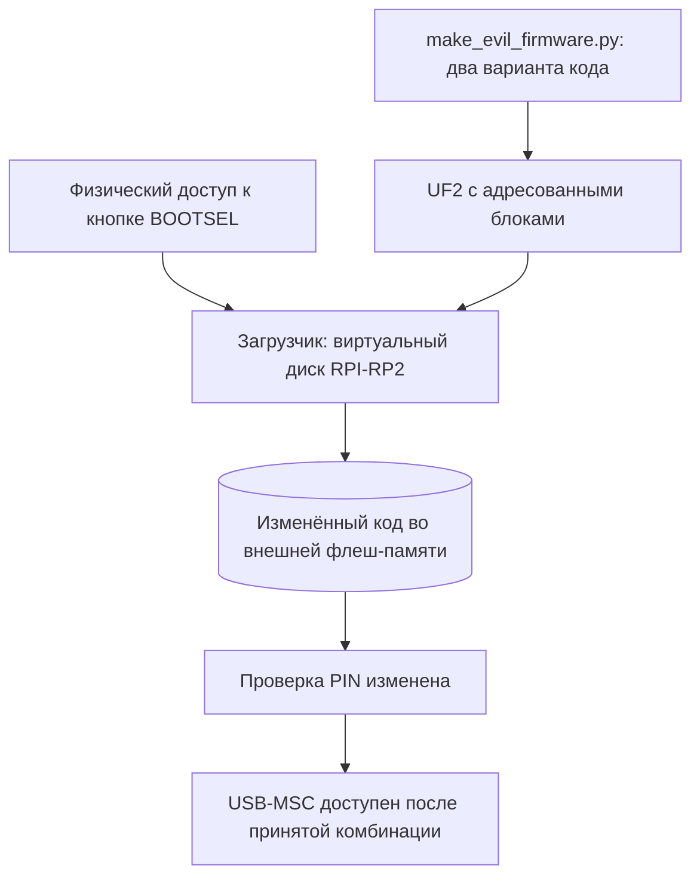

# Вектор 6 — подмена прошивки через BOOTSEL

При физическом доступе к кнопке BOOTSEL можно записать изменённую программу на RP2040 через штатный загрузчик без PIN. Прошивка не проходит проверку подписи перед запуском: патч в два байта убирает переход при несовпадении цифры, а патч в четыре байта заменяет эталон PIN на `1234`

## Вектор атаки и классификация

**Классификация:** физическая атака на целостность программного обеспечения, CWE-494 (выполнение неподтверждённого кода). CRC области boot2 проверяет целостность её байтов, но не удостоверяет источник остальной прошивки

**Условия:** доступ к кнопке BOOTSEL и USB-порту платы, подготовленный UF2-файл и компьютер. Доступ через обычный USB-MSC после ввода PIN не даёт возможности записать область кода: через него виден том данных, а не служебный режим прошивки

## Механизм

Для штатного перехода в BOOTSEL удерживают кнопку при подключении питания. Появляющийся USB-диск `RPI-RP2` — интерфейс загрузчика для записи UF2, **не представление всей флеш-памяти файлами**. Чтение полного дампа через другой интерфейс загрузчика описано в [векторе 0](../attack0/README.md)

В проверке PIN внутри `board_gpio_init` (`0x10000ab0`) инструкция `bne fail` по адресу `0x10000c8c` выполняет отказ при несовпадении цифры. [`make_evil_firmware.py`](make_evil_firmware.py) создаёт два варианта из исходного [`program.bin`](../reversing/program.bin):

| Вариант | Изменение | Следствие |
| --- | --- | --- |
| `evil_anypin` | `22 D1` → `00 BF` на `0x10000c8c`: `bne` заменён на `nop` | Сравнение больше не может завершиться отказом на этой ветке |
| `evil_pin1234` | `03 09 05 02` → `01 02 03 04` на `0x10005500` | Вместо штатного `3952` проверка принимает `1234` |

Файлы [`.bin`](evil_anypin.bin) и [`.uf2`](evil_anypin.uf2) содержат **кодовый префикс образа**, а не полный дамп с зашифрованным хранилищем. Изменения не затрагивают boot2 и остальные байты префикса. UF2 записывает только адресованные блоки кода, поэтому том данных остаётся на прежнем месте



## Воспроизведение

Из корня репозитория без прошивки физического сейфа:

```sh
python3 -m unittest discover -s attack6 -p 'test_*.py' -v
python3 attack6/demo.py artifacts/backup_full.bin
```

Тест проверяет точные байтовые отличия от исходного `program.bin`, содержимое готовых UF2 и отказ на неподходящем исходном образе. [`demo.py`](demo.py) встраивает каждый патч в **полный дамп** и запускает его в [rp2040js](../attack4/emulator-stand/README.md): сначала исходную прошивку, затем оба варианта с контрольными верным и неверным PIN. Для запуска нужен установленный `rp2040js` и bootrom согласно инструкции стенда. Готовые UF2 также можно загрузить на плату через BOOTSEL; этот физический шаг здесь не проводился

Чтобы заново проверить генерацию готовых BIN/UF2 из исходной программы, запустите `python3 attack6/make_evil_firmware.py reversing/program.bin` из корня репозитория. При наличии файлов с иными байтами генератор откажется их перезаписать; дизассемблирование изменённой ветки доступно при установленном `capstone`, а проверка поведения выполняется стендом выше

## Оценка атаки

**Сложность эксплуатации: низкая при физическом доступе** — патчи готовы, для загрузки UF2 нужны BOOTSEL и USB-кабель. Ограничение доступа к кнопке и контроль целостности образа повышают барьер; отсутствие проверки подписи у RP2040 от этого не исчезает. Для конфиденциальности и целостности устройства: `CVSS:3.1/AV:P/AC:L/PR:N/UI:N/S:U/C:H/I:H/A:N` — **6.1 (Medium)**

**Результат:** изменённая прошивка принимает комбинации, которые исходный код отклонял. Это подмена проверяющей программы, а не извлечение её старого PIN; извлечение исходного кода описано в [векторе 8](../attack8/README.md)

**Обнаружение:** эталонный SHA-256 полного образа, хранимый вне устройства, позволяет обнаружить изменённые байты после чтения по процедуре [вектора 0](../attack0/README.md). Без эталона байты эталонного PIN и перехода по указанным адресам можно сравнить с исходной прошивкой

### Как исправить

Для предотвращения подмены нужна проверка подлинности прошивки с аппаратным корнем доверия и включённым secure boot на подходящей платформе. RP2040 не предоставляет такого механизма: ограничение доступа к BOOTSEL уменьшает возможность физической атаки, но не добавляет проверку подписи

## Доказательство работоспособности

- [`test_firmware.py`](test_firmware.py) сверяет готовые BIN/UF2 с генератором и подтверждает: в коде отличаются только заявленные байты, а за кодовым префиксом полного дампа данные не меняются
- [`demo.py`](demo.py) на настоящем бинаре в эмуляторе подтверждает: исходная прошивка принимает `3952` и отвергает `1234`; `anypin` принимает `0000`; `pin1234` принимает `1234` и отвергает `3952`
- [`demo_output.txt`](demo_output.txt) содержит сохранённый протокол сборки и побайтовые отличия; старое ошибочное дизассемблирование таблицы данных в нём заменено пояснением. Эмулятор доказывает работу проверщика после патча; работоспособность загрузки UF2 **на живом сейфе** отдельно не измерена
