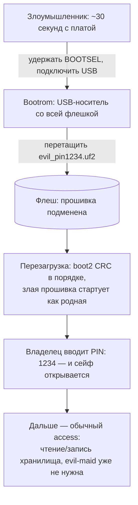

# Вектор 6 — подмена «хранителя»: злое прошивание через BOOTSEL

Самый дешёвый по инструментам вектор из всех: не нужны паяльная станция, дамп,
реверс на месте и даже знание PIN — достаточно **~30 секунд физического доступа**
и любого USB-кабеля. RP2040 не проверяет подпись прошивки (bootrom валидирует
только CRC32 самих 256 байт boot2), а режим BOOTSEL поднимает USB-носитель со
всей флешкой по удержанию кнопки при включении: злоумышленник перетаскивает
готовый UF2-файл — и с этого момента устройство работает на атакующего, выглядя
для владельца прежним

Прим.: нумерация «вектор 6» — это номер каталога `attack6/`, с гипотезами из
[`hypotheses.md`](../hypotheses.md) не связана

## Класс угрозы

CWE-494, Download of Code Without Integrity Check: устройство принимает и
исполняет любую прошивку без проверки подлинности; смежно CWE-345 (Insufficient
Verification of Data Authenticity) и CWE-693 (Protection Mechanism Failure —
на RP2040 из механизмов защиты фактически нет ни одного: ни secure boot, ни
защиты флеша от записи, ни readout protection — всё это появилось только в
RP2350)

## Почему это «самый возможный» вектор

- **ноль оборудования** — кнопка BOOTSEL и кабель; не нужен ни программатор,
  ни щупы, ни пайка ([attack2](../attack2/README.md) требует записи во флеш,
  [V9/V8 из каталога](../vectors/NEW_VECTORS.md) — осциллограф/адаптер)
- **ноль криптографии** — в отличие от
  [attack1](../attack1/README.md)/[attack3](../attack3/README.md), ломать шифр
  не нужно: подменяется тот, кто им шифрует
- **не требует PIN** — атакующему не нужен ни код
  [`3952`](../pin/README.md), ни тайминг-оракул
  ([attack4](../attack4/README.md)): подменённая прошивка открывает сама
- **доставляется штатной процедурой** — то, как владелец сам обновляет прошивку,
  и есть канал атаки; никакого «аномального» оборудования при доставке не
  появляется

Ограничение (честно): через USB-MSC записать прошивку нельзя — границы LBA из
[attack5](../attack5/README.md) отсекают область кода; доставить UF2 можно
только физически удержав BOOTSEL либо запрограммировав флеш offline. Зато
BOOTSEL — это штатная кнопка на плате

## Суть

Проверка PIN целиком живёт в двух местах образа, и оба правятся байтами:

```asm
; цикл сверки на 4-м нажатии кнопки энкодера (board_gpio_init, 0x10000ab0)
10000C86  ldrb  r2, [r3, r4]      ; введённая цифра
10000C88  ldrb  r3, [r5, r4]      ; эталон из rodata 0x100054FF
10000C8A  cmp   r2, r3
10000C8C  bne   0x10000cd4        ; несовпадение -> fail (мигание, сброс)
```

- **anypin** — `bne` (`22 D1`) заменяется на `nop` (`00 BF`): 2 изменённых байта,
  и ветка фейла недостижима — разблокировка любой комбинацией из 4 нажатий
- **pin1234** — эталон в rodata `0x100054FF` (`03 09 05 02` = 3952) переписывается
  на `01 02 03 04`: 4 изменённых байта, рабочий код становится `1234`
  (вариант «переприсвоить сейф», немаскируемый владельцем — его родной PIN
  перестаёт работать)

Оба варианта собраны скриптом
[`make_evil_firmware.py`](make_evil_firmware.py) из чистого образа
[`reversing/program.bin`](../reversing/), верифицированы дизассемблированием
изменённой области и упакованы в UF2 (family id `0xE48BFF56`, 112 блоков по
256 байтов, адреса от `0x10000000`) — готовые файлы лежат рядом:
`evil_anypin.bin/.uf2`, `evil_pin1234.bin/.uf2`. Лог сборки с диффами — в
[demo_output.txt](demo_output.txt)

Более стелсный вариант «двойного PIN» (родной работает + магический) требует
~12 байтов кодовой пещеры в пределах ±254 байта ветки `bne` — в образе такой
пещеры нет, оставлено как TODO (после [V12](../vectors/NEW_VECTORS.md) — при
перепрошивке можно раздвинуть и таблицы)

## Схема



## Эксплуатация

1. Удерживая BOOTSEL, подключить целевую плату по USB — она появится как диск
   `RPI-RP2` (это штатный режим, никакой разведки не нужно)
2. Скопировать `evil_pin1234.uf2` (или `evil_anypin.uf2`) — плата перезагрузится
   сама, окно атаки закрывается
3. Отойти. Владелец пользуется сейфом как обычно; с этого момента код
   `1234` (или любая комбинация в варианте `anypin`) открывает хранилище,
   и дальнейшие сценарии ([attack2](../attack2/README.md) — подмена содержимого,
   тихое копирование после «легального» открытия) выполняются без ограничений

На железе PoC не прогонялся (выверено статически: дизассемблер подтверждает
семантику обоих патчей, остальной образ побайтно не тронут, boot2 и таблица
векторов не изменены — CRC boot2 проходит как у исходного образа); поведение
после прошивки следует из декомпиляции `board_gpio_init` (`0x10000ab0`) и
[`pin/pin_sim.py`](../pin/pin_sim.py), который с точностью до байта моделирует
этот же проверочный цикл

## Оценка CVSS

`CVSS:3.1/AV:P/AC:L/PR:N/UI:N/S:U/C:H/I:H/A:N` — по спецификации **3.4**;
эксплойт-обвязка та же, что в [attack1](../attack1/README.md) (там для `C:H`
без `I:H` указано 4.6 — стоит прогнать все отчёты команды через один
калькулятор и зафиксировать числа). Содержательно: единственное условие —
короткий физический доступ, воздействие — полная потеря и конфиденциальности,
и целостности (сейф начинает служить атакующему), а владелец об этом не знает

## Как обнаружить

- **хэш образа**: дамп прошивки через тот же BOOTSEL (`picotool save -a`) и
  сравнение с эталонным SHA-256 — подмена из двух-шести байтов ловится мгновенно
  (продиффить можно прямо по таблице выше); без эталонного хэша — поиск
  аномалий: `evil_pin1234` видна байтами `01 02 03 04` по адресу `0x100054FF`,
  `evil_anypin` — `00 BF` по адресу `0x10000c8c`
- **поведение**: в варианте `pin1234` родной PIN владельца перестаёт работать —
  самый шумный вариант; `anypin` тих до первой чужой руки

## Как исправить

- перейти на RP2350 и включить **secure boot** (подписанная загрузка, boot ROM
  как корень доверия) — радикально закрывает вектор
- на RP2040 аппаратной опоры нет: минимизировать окно — хранить эталонный хэш
  образа вне устройства и проверять при каждом обслуживании; шлейф/кнопку
  BOOTSEL физически ограничить (корпус с пломбой); счесть физический доступ
  доверенной зоной — тогда вектор остаётся как документированный риск
- системно — те же рекомендации, что в
  [attack1](../attack1/README.md): ключ из `KDF(PIN)`, AEAD; но против подмены
  самого «хранителя» это не спасает — только целостность прошивки
