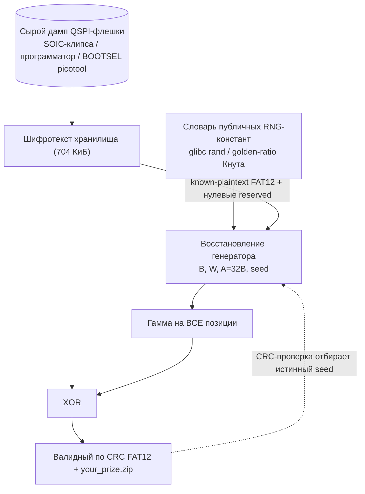

# Вектор 7 — крипта вскрывается без прошивки, из одного холодного дампа

Скрытое хранилище расшифровывается целиком **без анализа прошивки, без знания PIN и без единого обращения к устройству** — по одному сырому дампу внешней QSPI-флешки. Это сочестется с [attack1](../attack1/README.md) (ключ в прошивке) и [attack3](../attack3/README.md) (шифр слаб). Константы гаммы не извлекаются из образа, а восстанавливаются из самого шифротекста и предсказуемой структуры FAT12. PoC [`recover_keystream.py`](recover_keystream.py) делает это за 0.5 с и извлекает валидный по CRC архив

## Класс угрозы

CWE-1188/CWE-321 (жёстко зашитый, не секретный материал ключа) в связке с CWE-327 (слабый самодельный примитив) и CWE-323 (переиспользование гаммы по позициям). Дополнительно CWE-212 (нет безопасного стирания, см. N5). Практический итог: конфиденциальность хранилища не защищена ничем, кроме сокрытия шифротекста, а шифротекст снимается с внешнего чипа

## Строение гаммы (что именно восстанавливается)

Гамма — старший байт линейной функции позиции. Для байта со смещением `o` в секторе `L`:

```
global_block = L*32 + (o // 16)
V = ( seed + global_block*B + ((o % 16) - 1)*W )  mod 2^32
keystream_byte = V >> 24
plaintext = ciphertext XOR keystream_byte
```

Ключевые наблюдения:

- **два из трёх множителей — знаменитые публичные константы**: `B = 0x41C64E6D` это множитель LCG `rand()` из glibc/ANSI C (1103515245), `W = 0x9E3779B1` это golden-ratio константа мультипликативного хеша Кнута (2654435761)
- **множитель A не независим**: `A = 32*B mod 2^32` (генератор непрерывен, 32 блока по 16 байт на сектор) проверяется прямым умножением, отдельным секретом не является
- **побайтовые константы не отдельны**: `C_i = (i-1)*W` — арифметическая прогрессия, а не 16 независимых величин
- итог: единственный по-настоящему неизвестный параметр — аддитивный `seed`

## Как получить параметры из дампа прошивки

1. **B и W** — распознаются в словаре публичных RNG/hash-констант; проверка по консистентности с известным открытым текстом отбрасывает ложные пары.
2. `A = 32*B` — производный
3. **seed** — интервальным пересечением на кольце `Z/2^32`. Источники позиций с известным открытым текстом: (а) предсказуемые байты загрузочного сектора FAT12 (переход `EB xx 90`, OEM `MSDOS5.0`, `bytes/sector = 512`, сигнатура `55 AA`), и (б) **зарезервированные секторы, которые штатный MS-DOS-форматтер оставляет нулевыми** — их открытый текст `0x00`, а значит шифротекст равен гамме напрямую (in-band оракул, см. [N1](./extra_attacks.py)
4. **отбор истинного seed из множества потенциальных значений** — у пересечения по старшим байтам есть фундаментальный предел ~`2^24/N` кандидатов (см. ниже), поэтому seed сужается до нескольких тысяч. Истинный отбирается тем, что его том даёт валидный по CRC ZIP (это же и доказательство корректной расшифровки), проходит строгую проверку BPB и даёт корректную сигнатуру первого сектора FAT (`media, FF, FF`) — все эти байты в пересечении не участвовали

### Про класс эквивалентности seed (честная оговорка)

Из холодного дампа seed определяется не точкой, а **классом ~844 значений, которые дают побайтово идентичную расшифровку всех 704 КиБ** (левые концы всех интервальных арок лежат в `[x-2^24, x]`, отсюда предел `~2^24/N`). PoC находит член этого класса (`0x9E37A9B7`); прошивка использует `0x9E37A9EA` — но по дампу их различить нельзя и не нужно: весь контент расшифровывается точно. Точечное значение потребовало бы известного открытого текста на высоких `L`, которого в холодном дампе нет

## Схема



## Дополнительные следствия (демо — [`extra_attacks.py`](extra_attacks.py))

- **N1 — in-band оракул нулей**: нулевые области внутри тома (reserved-секторы, свободные кластеры, пустые записи FAT/каталога) отдают гамму напрямую (шифротекст == гамма). В этом дампе так утекает ~19 КиБ гаммы, и именно они бутстрапят восстановление — ни устройство, ни slack-секторы [attack5](../attack5/README.md) не нужны
- **N3 — мастер-таблица гаммы**: гамма зависит только от позиции и глобальных для сборки констант, поэтому одна предвычисленная таблица 704 КиБ = ключ всей серии. Расшифровка сводится к `xor` без кода и без знания констант; таблицу можно опубликовать один раз на все устройства
- **N4 — two-time-pad**: два тома, зашифрованных на одних позициях, делят гамму, и она сокращается: `C1 XOR C2 = P1 XOR P2`. При известной одной стороне (crib) вторая восстанавливается без ключа вовсе
- **N5 — нет безопасного стирания**: удаление файла в FAT только помечает запись каталога байтом `0xE5`, данные в кластерах остаются; на сыром флеше с позиционной гаммой «удалённый» файл расшифровывается полностью. Форензик-остаточность из коробки

## Цепочка «без холодного дампа и без PIN» (ответ на второй вопрос)

Разбор `board_gpio_init` (`0x10000ab0`) показал: до верного PIN USB не поднимается (`tud_init` вызывается только после блокирующего цикла энкодера, call-site `0x100008a6`), а сам цикл — бесконечный с единственным выходом при вводе `{3,9,5,2}`; чистой энкодерной лазейки без верного PIN нет. Отсюда реальные маршруты «без дампа и без PIN», все через USB-порт/пины энкодера, без выпайки чипа:

1. **энкодер-оракул → USB → данные**: тайминг-оракул `sleep_ms(50)` на верную ведущую цифру ([attack4](../attack4/README.md)) плюс отсутствие блокировки/лимита попыток → разблокировка за ≤40 нажатий **без знания PIN**, только по пинам энкодера. После разблокировки USB-диск поднят → файлы читаются напрямую, либо снимается гамма из slack ([attack5](../attack5/README.md)) для вечной офлайн-расшифровки. Ни дампа, ни знания PIN, ни реверса
2. **BOOTSEL/PICOBOOT через сам USB-порт**: bootrom RP2040 даёт чтение/запись/выполнение флеша и RAM мимо прошивки и PIN, без выпайки — так и снят исходный дамп ([attack6](../attack6/README.md))
3. **VBUS-глитч через кабель**: сбить единственную ветку `bne 0x10000c8c` fault-инъекцией по линии питания USB → разблокировка с неверным PIN (модель и бюджет — в [`../vectors/ORIGINAL_VECTORS.md`](../vectors/ORIGINAL_VECTORS.md))

## Оценка CVSS

Базовый сценарий (нужен один физический доступ, чтобы снять дамп через BOOTSEL/чип): `CVSS:3.1/AV:P/AC:L/PR:N/UI:N/S:U/C:H/I:N/A:N` — **4.6 (Medium)**, как в [attack1](../attack1/README.md)/[attack3](../attack3/README.md). Ценность вектора не в цифре, а в снятии последнего барьера: даже «спрятанный как следует» ключ не помог бы — примитив вскрывается из шифротекста и структуры тома. С учётом N3 (мастер-таблица на всю серию) масштаб воздействия выходит за одно устройство

## Как исправить

- заменить самодельную гамму на стойкий аутентифицированный шифр (AEAD), ключ — из `KDF(PIN)` и аппаратного секрета (OTP на RP2350), а не из констант сборки
- на каждый сектор — уникальный nonce, чтобы гамма не повторялась по позициям (закрывает N3/N4)
- безопасное стирание при удалении (закрывает N5); заполнять свободное место случайными данными при производстве (ломает in-band оракул N1)
- эти пункты совпадают с рекомендациями [attack1](../attack1/README.md)/[attack3](../attack3/README.md)/[attack5](../attack5/README.md) — по сути одна замена всей криптосхемы

## Воспроизведение

Полный прогон — в [`demo_output.txt`](demo_output.txt). Вход `<dump>` — сырой 2-МБ дамп флеша:

```
python3 recover_keystream.py <dump> storage_decrypted.img   # восстановить генератор и расшифровать том
python3 extra_attacks.py <dump>                             # N1/N3/N4/N5
RECOVER_DUMP=<dump> python3 test_recover.py                 # регрессия + фальсификация (интеграция при заданном RECOVER_DUMP)
```

Проверка независимыми средствами: `recover_keystream.py` доказывает корректность по CRC вложенного ZIP (не по эталонным константам), `test_recover.py` включает синтетический end-to-end и фальсификацию (порча одного байта ZIP и удаление истинных констант из словаря обязаны ломать восстановление), `mdir` из mtools листает расшифрованный том сторонним инструментом
