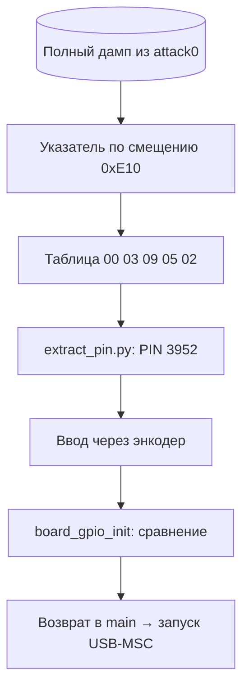

# Вектор 7 — извлечение PIN из прошивки

Четырёхзначный PIN сейфа хранится в прошивке открытыми байтами. После получения [полного дампа](../attack0/README.md) его можно извлечь офлайн, не перебирая код энкодером. В исследованном образе PIN — **`3952`**

## Вектор атаки и классификация

**Классификация:** программная уязвимость хранения учётных данных, CWE-798 (жёстко заданный PIN). Доступ к дампу требует физического контакта с устройством; извлечение PIN из уже полученного файла — статический анализ

**Условия:** полный образ флеш-памяти, например [`artifacts/backup_full.bin`](../artifacts/backup_full.bin). PIN не участвует в шифровании хранилища: для офлайн-чтения данных он не нужен, см. [вектор 1](../attack1/README.md). Этот вектор показывает возможность разблокировать устройство штатным способом после извлечения кода

## Механизм

В `board_gpio_init` (`0x10000ab0`) при четвёртом нажатии энкодера прошивка сравнивает введённые цифры с таблицей в rodata. Указатель из пула по смещению `0xE10` образа ведёт на `0x100054FF`; там лежат байты `00 03 09 05 02`. Первый байт не участвует в сравнении: индексы 1–4 дают PIN `3952`

```text
0x10000C82  add   r3, sp, #0x33
0x10000C86  ldrb  r2, [r3, r4]   ; введённая цифра
0x10000C88  ldrb  r3, [r5, r4]   ; цифра из таблицы
0x10000C8A  cmp   r2, r3
0x10000C8C  bne   fail           ; ранний выход при несовпадении
0x10000C92  bl    sleep_ms       ; 50 мс после совпадения
```

После успешной проверки `board_gpio_init` возвращает управление `main`, и только затем вызывается `tud_init`: до верного кода USB-MSC не поднимается. Флаг SRAM `0x20002ED2` управляет индикацией и не является самостоятельным условием запуска USB. Побайтовая задержка создаёт **другой путь получения PIN без дампа** — тайминг-оракул [вектора 4](../attack4/README.md)



## Воспроизведение

```sh
python3 attack7/src/extract_pin.py artifacts/backup_full.bin
python3 attack7/src/pin_sim.py
python3 -m unittest discover -s attack7/src -p 'test_*.py' -v
```

[`extract_pin.py`](src/extract_pin.py) читает указатель и цифры **из образа**, а не возвращает заранее записанный в коде PIN. [`pin_sim.py`](src/pin_sim.py) использует извлечённый эталон и моделирует сравнение всех `10^4` комбинаций; он не эмулирует USB-контроллер. Для проверки на настоящем бинаре есть [стенд rp2040js](../attack4/emulator-stand/README.md): `node src/stand.mjs ../../artifacts/backup_full.bin 3952` из его каталога и контрольный прогон с `3951`

## Оценка атаки

**Сложность эксплуатации: низкая после получения дампа** — извлечение требует одного чтения байтов по указателю. Для получения самого дампа нужен физический доступ к BOOTSEL, описанный в [векторе 0](../attack0/README.md)

**Результат:** известен PIN штатного интерфейса. Сам этот шаг не извлекает открытый текст хранилища и не доказывает наличие тайминг-утечки: её физический эксперимент и [видео](../attack4/out/oracle-attack.mp4) относятся к вектору 4

Доступ к кнопке BOOTSEL можно ограничить корпусом, но PIN в доступной прошивке остаётся извлекаемым при чтении флеш-памяти. Один и тот же PIN применим к другим платам **при условии**, что на них записан тот же образ; отдельные платы этим стендом не сравнивались

### Как исправить

Не хранить один и тот же PIN открытыми байтами в прошивке всех устройств. Для аппаратной защиты данных нужен независимый ключ в защищённом хранилище и производный от PIN материал с ограничением числа попыток; один только четырёхзначный PIN не выдерживает офлайн-перебор после утечки дампа

## Доказательство работоспособности

- [`extract_pin.py`](src/extract_pin.py) выводит `PIN: 3952` на исходном дампе; тест меняет одну цифру в копии образа и проверяет, что извлечённое значение меняется вместе с ней
- [`pin_sim.py`](src/pin_sim.py) принимает ровно один код из всех `10^4` комбинаций и показывает длину совпавшего префикса для симулированного проверщика
- Эмулятор настоящей прошивки отличает `3952` от `3951` по флагу разблокировки; его [протокол](../attack4/out/emulator-stand/demo_output.txt) подтверждает выполнение проверочного цикла, но не заменяет проверку USB-MSC на живой плате
